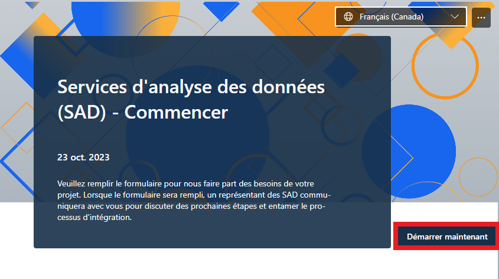

Inscrivez-vous ici pour faire partie de la Communauté des premiers utilisateurs de l'Analyse des données en tant que service (ADS). Allez au portail de l'analyse de données en tant que service et cliquez sur le bouton "Commencer".
 
[https://www.statcan.gc.ca/data-analytics-services](https://www.statcan.gc.ca/data-analytics-services)

_Cliquez sur le bouton «Français (Canada)» du formulaire pour changer la langue en français._

Si vous avez déjà obtenu l'accès à la plateforme, consultez les directives pour savoir [comment ouvrir une session](SeConnecter.md).

Avant de vous connecter vous aurez accès au boutton ***Commencer***.
En cliquant sur le boutton il vous sera demandé de vous connecter.
            

Une fois sur la page principale, vos pourrez enregistrer un nouveau projet en cliquant sur le bouton ***Start a New project***
            