# Langue
Le document décrit la façon de changer la langue dans les différents services offerts.

## Portail Azure
Pour modifier les paramètres de langue du portail Azure, voici les étapes à suivre:

1. Cliquez sur le menu **Paramètres** dans l'en-tête de la page principale.
2. Cliquez sur l'onglet **Langue et région**.
3. Utilisez les menus déroulants pour choisir la langue préférée et le format régional approprié.
4. Cliquez sur le bouton **Appliquer** pour mettre à jour vos paramètres de langue et de format régional.

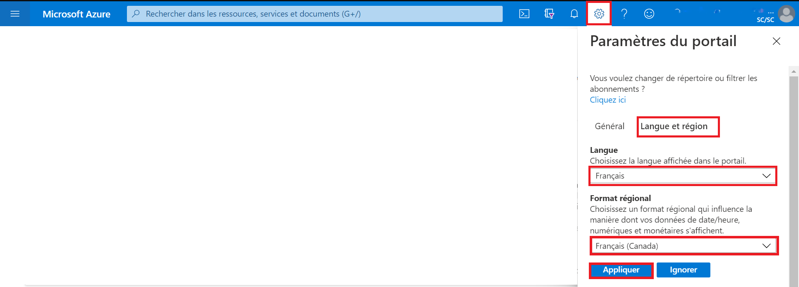

## Tableau de bord
Pour accéder au tableau de bord en français de l’environnement d’Analyse collaborative (EAC), voici les étapes à suivre:

1.	À partir de la liste des tableaux de bords, cliquez sur la flèche correspondant au nom du tableau de bord.
2.	Sélectionnez le tableau de bord **Environnement d’Analyse Collaborative** dans la liste affichée.
</br>**Note:** Si ce tableau de bord n'est pas dans la liste, cliquez sur **Parcourir tous les tableaux de bord** pour accéder à la liste complète des tableaux de bord.

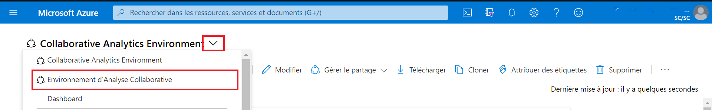

## DataFactory
Cet outil est disponible uniquement en anglais pour le moment.


## Databricks
Cet outil est disponible uniquement en anglais pour le moment.


## Machines Virtuelles
### Serveur Windows
Pour configurer la langue d'affichage dans une machine virtuelle Windows, voici les étapes à suivre:

1.	Selectionnez **Paramètres**.
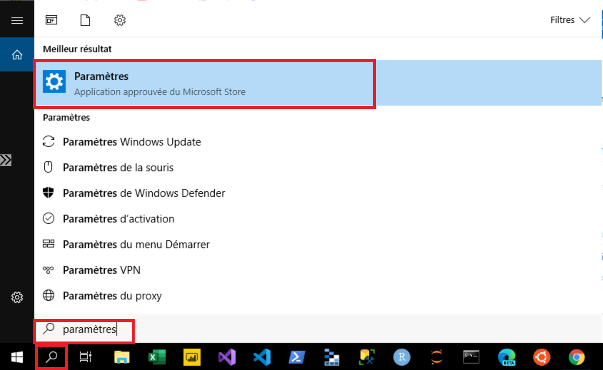

2. Sélectionnez **Heure et langue**.
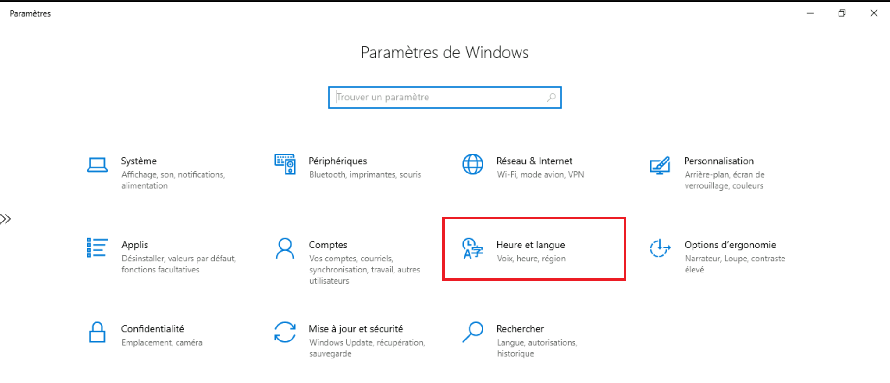

3. Sélectionnez **Langue**. Utilisez le menu déroulant sous l'en-tête **Langue d’affichage de Windows** pour choisir la langue désirée.  
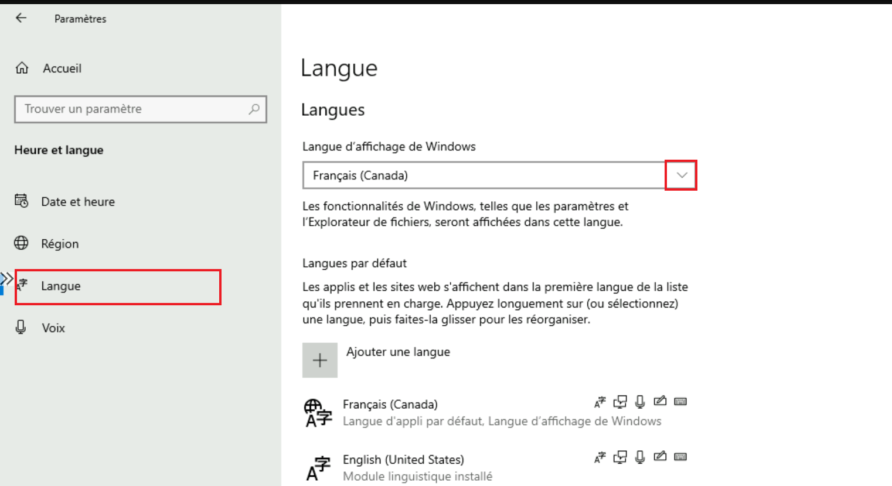

4. La zone de langue d'affichage de Windows doit maintenant comprendre la langue choisie. Pour être en mesure d'appliquer la nouvelle langue, déconnectez-vous de la session Windows actuelle, puis reconnectez-vous.

### Serveur Ubuntu
<!-- Pour configurer la langue d'affichage d'une machine virtuelle Ubuntu, voir [Paramètres de langue](https://help.ubuntu.com/stable/ubuntu-help/prefs-language-install.html.fr). -->
Si vous utilisez l'application **X2GO** pour accéder à l'interface graphique de votre machine Ubuntu, notez que par défaut la session est disponible en anglais uniquement. Il sera donc necessaire d'installer des modules supplementaires de langue manuellement.

## Azure Apprentissage automatique
Pour modifier les paramètres de langue dans l’espace de travail d'apprentissage automatique Microsoft Azure, voici les étapes à suivre:

1. Cliquez sur le menu **Paramètres** dans l'en-tête de la page principale.

2. Sous **Langue et formats**, utilisez les menus déroulants pour choisir la langue préférée et le format régional approprié.

3. Cliquez sur le bouton **Appliquer** pour mettre à jour vos paramètres de langue et de format régional.

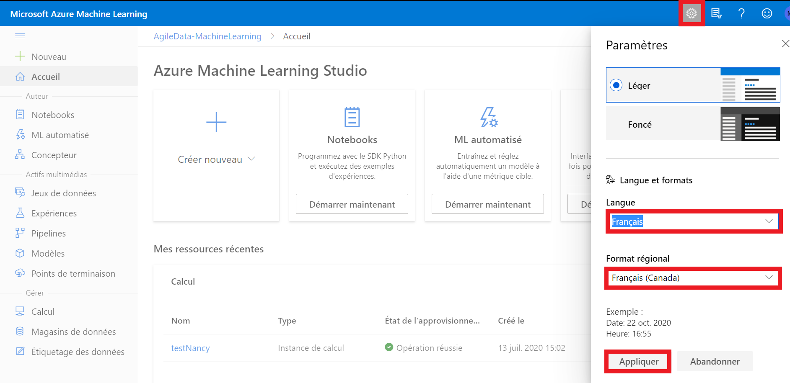

###  Azure Apprentissage automatique - Jupyter Lab
1. Exécutez dans le terminal d'instance de calcul Azure ML:
```sh
pip install jupyterlab==3
```
2. Redémarrez l'instance de calcul
3. Exécutez dans le terminal d'instance de calcul Azure ML:
```sh
pip install git+https://github.com/StatCan/jupyterlab-language-pack-fr_FR
```
4. Dans JupyterLab, sélectionnez Paramètres - Langue - Français

## Slack

Pour modifier les paramètres de langue dans l’application Slack, voici les étapes à suivre:
1. Cliquez sur l’**icône de profil** dans l'en-tête de la page principale.

2.  Cliquez sur **Préférences**.

 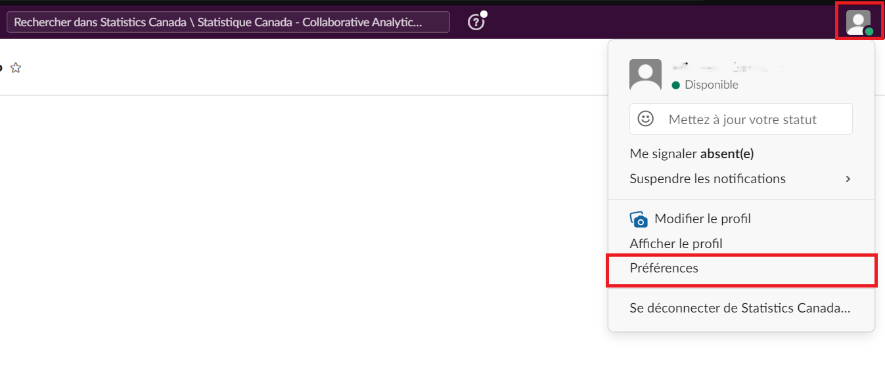

4.	Sélectionnez l’onglet **Langue et région**.

5.	 Sous **Langue**, utilisez le menu déroulant pour choisir la langue préférée.  

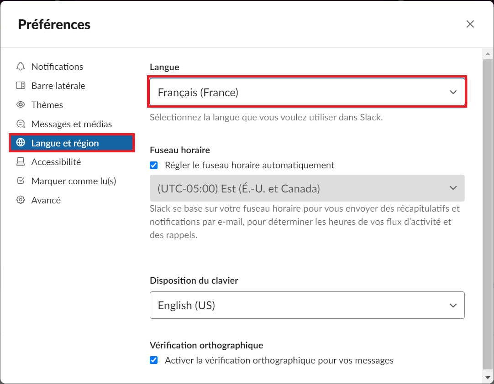

4. Fermez la fenêtre **Préférences**.


## Explorateur de stockage Microsoft Azure

Par défaut, cette application détermine la langue d'utilisation en fonction des préférences linguistiques définies sur votre ordinateur.

Pour modifier les paramètres de langue dans l’Explorateur de stockage Microsoft Azure, voici les étapes à suivre:

1.	Cliquez sur **Modifier**.

2.	Cliquez sur **Paramètres**.

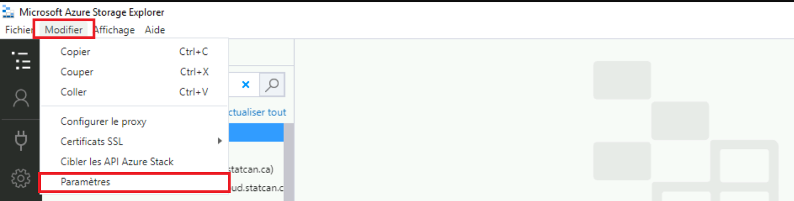

3.	Dans la page des paramètres, sélectionnez **Application**. Sous **Paramètres régionaux**, utilisez le menu déroulant pour choisir votre langue préférée.

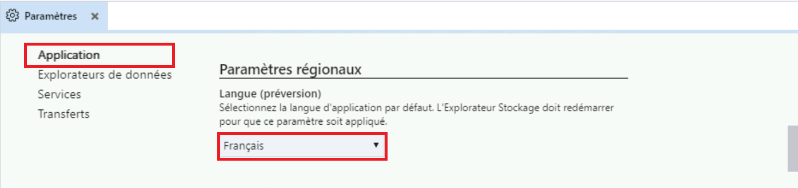

4.	Pour appliquer la nouvelle langue, fermez puis relancer l’application.


## Power BI

Pour obtenir plus de renseignements, vous pouvez consulter l’article « [Langues et pays/régions pris en charge pour Power BI](https://docs.microsoft.com/fr-fr/power-bi/fundamentals/supported-languages-countries-regions) ».

### Service Power BI

Par défaut, le service Power BI détermine la langue d’utilisation en fonction des préférences linguistiques définies sur votre ordinateur. Les étapes à suivre pour afficher et modifier ces préférences peuvent varier selon votre système d’exploitation et votre fureteur.

Pour changer la langue du menu dans le service Power BI, voici les étapes à suivre:

1.	Dans le service Power BI, cliquez sur l’**icône Paramètres**, puis sélectionnez **Paramètres**.

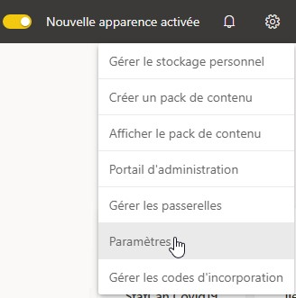  


2.	Sous l’onglet **Général**, sélectionnez **Langue**.

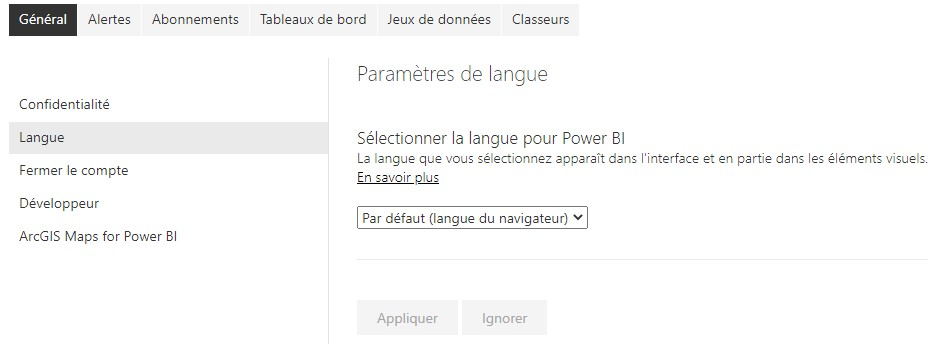  

3.  Sélectionnez votre langue préférée, puis cliquez sur **Appliquer**.

Pour obtenir plus de renseignements, consultez l’article « [Langues disponibles pour le service Power BI](https://docs.microsoft.com/fr-fr/power-bi/fundamentals/supported-languages-countries-regions#languages-for-the-power-bi-service) ».

### Power BI Desktop

Par défaut,

•	la **Langue de l'application** est fondée sur la **Langue de Windows**

•	la **Langue du modèle** est fondée sur  la **Langue de l'application**

•	les **étapes de la requête** sont fondées sur  la **Langue de l'application**


Il est recommandé de fixer la langue du modèle à **English (United States)**.

La langue du modèle s'applique seulement **au moment de la création du rapport** et **ne peut pas être changée** dans les rapports existants. Ainsi, il est recommandé de fixer la langue du modèle à **English (United States)**, sauf si vous avez besoin d’utiliser une autre langue pour le modèle de rapport. Les comparaisons de chaîne de caractères et les champs de date internes sont affectés par cette configuration.

Pour changer la langue du menu et la langue du modèle dans Power BI Desktop, voici les étapes à suivre:

1.	Ouvrez le menu **Options**.

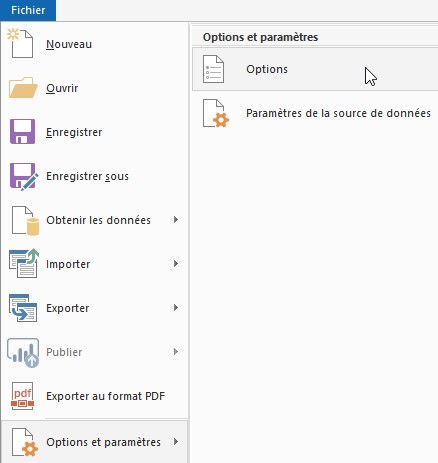     

2.	Sous **GLOBAL**, cliquez sur **Paramètres régionaux**, et fixez la **langue de l’application** et la **langue du modèle** à la langue souhaitée.

 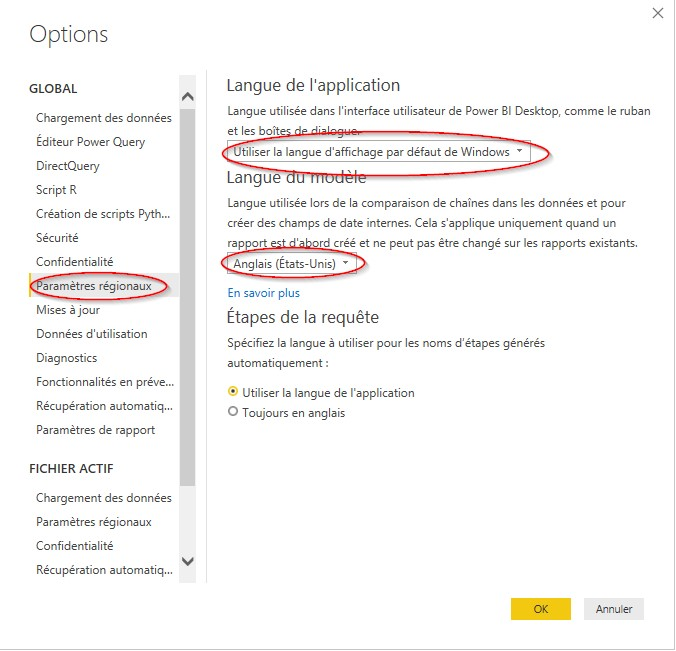  

**NOTE**: La **langue d'importation** des données est fixée séparément dans les  **Paramètres régionaux** de la section **FICHIER ACTIF**. Vous devez la changer seulement si vous importez des fichiers de données comportant des nombres ou des dates suivant des paramètres régionaux précis (p. ex. le format de date JJ/MM/AAAA de l’anglais du Canada et le format de date MM/JJ/AAAA de l’anglais des États-Unis).

## Fureteurs Web

* [Chrome](https://support.google.com/chrome/answer/173424?co=GENIE.Platform%3DDesktop&hl=fr)
* [Safari](https://support.apple.com/fr-ca/guide/mac-help/mh26684/mac)
* [Edge](https://support.microsoft.com/fr-fr/microsoft-edge/utiliser-microsoft-edge-dans-une-autre-langue-4da8b5e0-11ce-7ea4-81d7-4e332eec551f)
* [Firefox](https://support.mozilla.org/fr/kb/utiliser-firefox-dans-autre-langue)
* [Opera](https://help.opera.com/en/latest/customization/#changeLanguage) (en anglais seulement)
