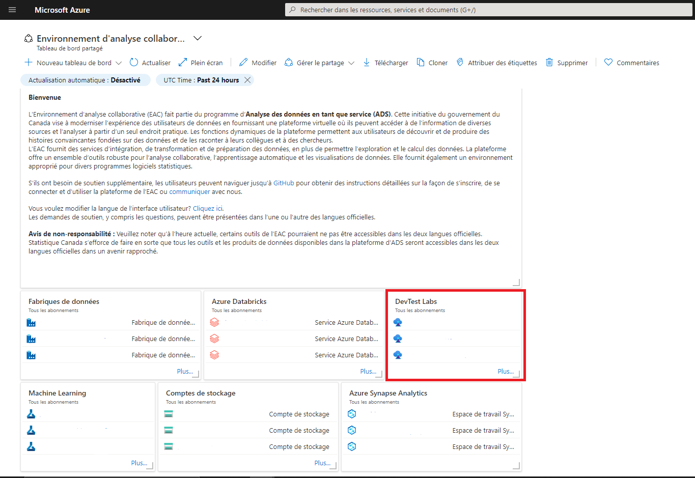

_[English](../../en/VirtualMachines)_
# Machines virtuelles

## Trouvez votre laboratoire DevTest

1.  Dans le portail Azure, cliquez sur le laboratoire DevTest dans le tableau de bord personnalisé de votre projet. 
2.  Sélectionnez le DevTest Lab qui a été attribué.

## Créez votre machine virtuelle

**Note :** Dans certains cas, une machine virtuelle aura été créée au préalable pour vous et vous n'aurez pas l'autorisation d'en créer une.
Si vous devez apporter des changements à votre machine virtuelle, consultez la [FAQ](FAQ.md).

1.  À partir de la page **Vue d'ensemble** du laboratoire DevTest, cliquez sur le bouton **+ Ajouter**.

2.  Choisissez une base appropriée pour votre machine virtuelle (p. ex. Data Science Virtual Machine - Windows Server 2019). Pour en savoir
    plus sur le logiciel inclus dans l'image de machine virtuelle pour la science des données (Data Science Virtual Machine), veuillez
    [cliquer ici](https://docs.microsoft.com/fr-ca/azure/machine-learning/data-science-virtual-machine/tools-included).

3.  Entrez un nom pour votre machine virtuelle ainsi qu'un nom d'utilisateur et un mot de passe que vous utiliserez pour vous
    connecter à la machine virtuelle. Décochez les cases *Utiliser un secret enregistré* et *Enregistrer comme mot de passe par défaut*.

4. Vous pouvez cliquer sur le lien **Changer la taille** pour modifier la taille de votre machine virtuelle si vous le souhaitez.

    Laissez les autres champs par défaut et cliquez sur le bouton **Créer**.

 

## Trouvez votre machine virtuelle

1.  Faites défiler la page **Vue d'ensemble** du laboratoire DevTest jusqu'à ce que vous voyiez votre machine virtuelle sous **Mes
    machines virtuelles**. Cliquez sur votre machine virtuelle pour en afficher la **Vue d'ensemble**.

## Démarrez votre machine virtuelle

1.  À partir de la page **Vue d'ensemble** de votre machine virtuelle, cliquez sur le bouton **Démarrer**.

  
 
2. Le demarrage de la machine virtuelle prendra quelques minutes. Surveillez l'avancement du démarrage en cliquant sur l'icône Notifications dans le coin supérieur droit de la fenêtre.

## Connectez-vous à votre machine virtuelle

1.  À partir de la page **Vue d'ensemble** de votre machine virtuelle, cliquez sur **Connexion du navigateur** (si vous ne voyez pas ce bouton, vous devrez peut-être cliquer sur le bouton **Connecter**, puis choisir **Bastion** dans le menu déroulant).

2.  Veuillez à cocher la case *Ouvrir dans une nouvelle fenêtre*, puis entrez le nom d'utilisateur et le mot de passe que vous avez utilisé au moment de créer votre machine virtuelle, et cliquez sur le bouton **Connecter**. Votre machine virtuelle devrait s'ouvrir dans un nouvel onglet du navigateur.

    **Note** : Par défaut, la machine virtuelle **Ubuntu** s'ouvre en mode Serveur Terminal. Vous pouvez acceder à l’interface graphique de votre machine Ubuntu à l'aide de l'application [X2Go](https://docs.microsoft.com/fr-fr/azure/machine-learning/data-science-virtual-machine/dsvm-ubuntu-intro#x2go), à partir de votre machine Windows.

    **Note** : Après avoir tenté de vous connecter pour la première fois, une erreur peut apparaître indiquant qu'un bloqueur de fenêtres contextuelles empêche l'ouverture d'une nouvelle fenêtre. Pour le désactiver, une icône apparaîtra dans la barre de recherche du navigateur, sélectionnez le bouton et cliquez sur **toujours autoriser**.
    
    

## Arrêtez votre machine virtuelle

Les machines virtuelles entraînent des coûts uniquement quand elles sont en marche. Pour éviter les dépenses inutiles, vous devez arrêter votre
machine virtuelle lorsque vous ne l'utilisez pas. 1. À partir de la page **Vue d'ensemble** de votre machine virtuelle, cliquez sur le bouton
**Arrêter**.

# Changer la langue d'affichage
Voir la page [Langue](Langue.md) pour savoir comment changer la langue d'affichage.
