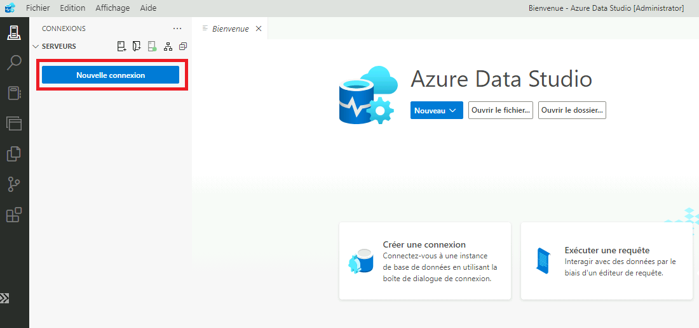

_[English](../../fr/PostgreSQL)_
# Base de données Azure PostgreSQL
Une base de données Azure PostgreSQL peut être créée à l'avance si vous en avez besoin pour votre projet.

**Rappel**: Les bases de données Azure PostgreSQL de l'Environnement d'Analyse Collaborative (EAC) sont seulement disponibles à partir de l'environnement infonuagique de l'EAC. Vous ne pouvez y accéder à partir des centres de données du gouvernement du Canada.

## Accès à une base de données Azure PostgreSQL

### Azure Data Factory
On peut créer un service lié dans Azure Data Factory. Configurez le service lié pour se connecter via le runtime d'intégration auto-hébergé et entrez le nom d'utilisateur et le mot de passe. 
Le nom d'utilisateur est votre **compte cloud** ou groupe AD si l'accès a été donné à un groupe auquel vous appartenez, suivi du nom du serveur.
Le mot de passe est un jeton d'accès d'Azure AD tel que décrit ci-dessous au point 6 de la section pgAdmin

ou

Veuillez communiquer avec l'équipe de soutien par l'intermédiaire du canal https://cae-eac.slack.com si vous avez besoin d'aide.

### Machine virtuelle

Vous pouvez vous connecter à une base de données Azure PostgreSQL à partir de votre machine virtuelle en infonuagique, en utilisant une application telle que: 
1. pgAdmin
2. Azure Data Studio
3. Visual Studio Code

#### Prérequis
1.  Une **machine virtuelle** dans l'EAC. Voir la page [Machines Virtuelles](VirtualMachines.md) pour plus d'informations.
2.  **pgAdmin** ou un autre outil tel que **Azure Data Studio** and **Visual Studio Code**. Ces deux derniers sont disponibles par défaut dans les images de machine virtuelle **Data Science Virtual Machine**.

# pgAdmin
Ceci est l'un des outils les plus connus pour la gestion et l'administration de base de données Azure PostgreSQL.

1.  Dans votre **machine virtuelle** installez pgAdmin disponible depuis https://www.pgadmin.org/download/

2.  Connectez-vous à votre **machine virtuelle** dans l'EAC et lancez **pgAdmin**.

    

3.  Avec le bouton droit de la souris, ajouter le serveur auquel vous devez vous connecter dans le coin supérieur gauche.

    

4.  Dans l'onglet General, entrez un nom pour le server. Vous pouvez entrer le **nom de votre serveur PostgreSQL**
    Dans l'onglet Connection, entrez le **nom complet de votre serveur PostgreSQL** puis entrez votre **compte Cloud** comme nom d'utilisateur suivi par le nom du serveur
    ou le nom du groupe AD auquel vous appartenez suivi par le nom du serveur si l'accès au serveur a été accordé à ce groupe.

    

5.  Vous pouvez maintenant  voir le nouveau serveur que vous venez d'ajouter dans la liste des serveurs. 
    Cliquez dessus pour vous connecter et il vous sera demandé d'entrer un mot de passe

    

6.  Le mot de passe que vous devez entrer est un jeton d'accès d'Azure AD qui sera généré pour un usager authentifié 
    À l'aide de PowerShell, vous pouvez générer le jeton d'accès en entrant la commande suivante

    *az account get-access-token --resource https://ossrdbms-aad.database.windows.net*

    Le résultat se présente comme suit où vous devez copier la valeur de accessToken et vous en servir comme mot de passe dans pgAdmin

    

# Azure Data Studio

1. Connectez-vous à votre **machine virtuelle** dans l'EAC et lancez **Azure Data Studio**.

   

2. Les détails de connexion se présentent comme suit,
   Avec le nom d'utilisateur qui peut être votre **compte Cloud** suivi du nom du serveur:

   *firstname.lastname@cloud.statcan.ca@servername.postgres.database.azure.com*
   ou
   *firstname.lastname@cloud.statcan.ca@servername*
 
   Si l'accès au serveur a été accordé à un groupe AD auquel vous appartenez,

   *AD-Group@servername.postgres.database.azure.com*
   ou
   *AD-Group@servername*

   
