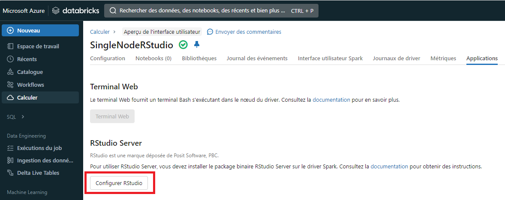

_[English](../en/R-Shiny.md)_
# R-Shiny à partir de RStudio
Ce document décrit comment accéder R-Shiny à partir de l'application Rstudio.

## Commencer

Afin d'utiliser R-Shiny, s.v.p. envoyer un message [Slack](https://cae-eac.slack.com) à l'équipe de l'EAC pour activer RStudio dans votre cluster Databricks.

**Avertissement** :
Les clusters R-Shiny s'éteignent **tous les jours à 19h**. Pour réduire vos coûts, veuillez arrêter vos clusters R-Shiny lorsque vous ne les utilisez pas.

## Accès à R-Shiny

1.	À partir du portail Azure, lancer l'espace de travail Databricks qui vous a été créé.
2.	À partir de l'espace de travail Databricks, cliquez sur **Cluster**.
    

3. À partir de la liste de clusters disponibles, selectionnez le cluster sur lequel RStudio a été installé.
    

    **Note:** Le cluster doit être active pour accéder à l'application RStudio. Consulter la [section Databricks](DataBricks.md) pour plus de détails à propos du démarrage d'un cluster.

4.	Selectionnez l'onglet **Apps**.
    

5.	Cliquez sur **Set up RStudio**.
      

6.  Un **mot de passe à usage unique** est généré pour vous, cliquez sur **show** pour l'afficher et le copier.
    

7.	Cliquez sur **Open RStudio**.
    

8.	Une nouvelle fenêtre s'ouvre, entrez le nom d'utilisateur et le mot de passe fournis (Étape 6) dans le formulaire de connexion afin de démarrer RStudio.

    

9.	À partir de l'interface RStudio, entrez la commande **library(shiny)** dans la console afin d'importer la librarie Shiny.
    


## Exemple d'une application R-Shiny

Vous pouvez utiliser l'exemple **Hello Shiny** pour explorer la structure d'une application Shiny.

1. Lancer l'application à partir de votre session RStudio en entrant les commandes suivantes:

    library(shiny)

    runExample("01_hello")

2.	Votre application devrait correspondre à l'image ci-dessous.
    


## Accès aux fichiers à partir du lac de données

Par défaut, le répertoire de travail dans RStudio se trouve sur le noeud du pilote du cluster Databricks. Pour conserver votre travail, vous devrez utiliser DBFS.

1. Pour avoir accès au DBFS dans l'explorateur de fichiers, cliquez sur le bouton **...** à droite et entrez **/dbfs/mnt/**.


2. Le lac de données sera disponible et vous pourrez y accéder et stocker vos fichiers. Lorsque votre cluster s'éteint à la fin de votre session, votre travail reste disponible à votre retour.

**NOTE:** Voici des exemples de code pour accéder à vos fichiers à partir du lac de données.
```
library(SparkR)
sparkR.session()
testData = as.data.frame(read.df("/mnt/le chemin du fichier", source = "l'extension du fichier", header="true", inferSchema = "true"))
str(testData)
```

```
setwd("/dbfs/mnt/le chemin du fichier")
testData = read.csv("le nom du fichier")
str(testData)
```

# Changer la langue d'affichage
Voir la page [Langue](Langue.md) pour savoir comment changer la langue d'affichage.
