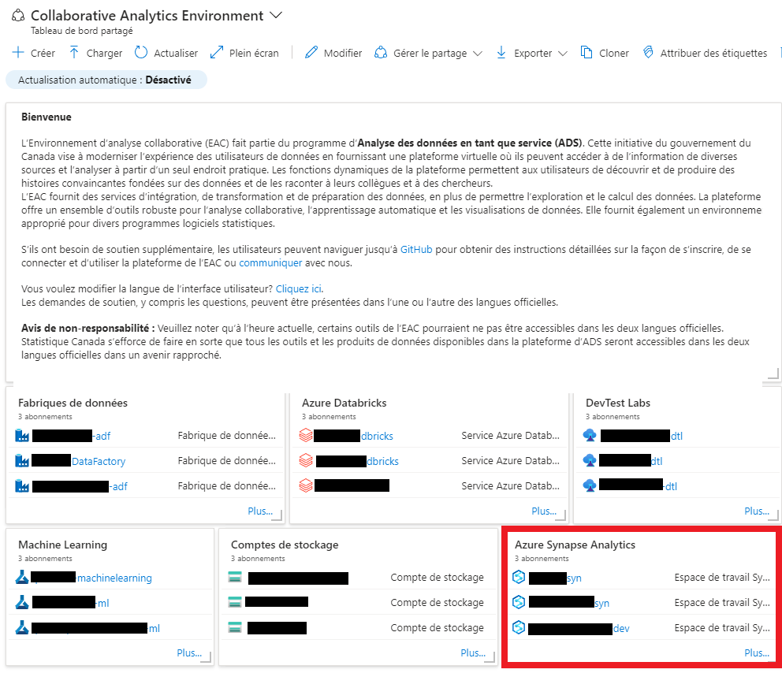

Les tableaux de bord affichent vos ressources infonuagiques dans le portail Azure de façon précise et organisée. Ils servent d'espace de
travail où vous pouvez rapidement lancer des tâches pour les opérations quotidiennes et surveiller les ressources. Par exemple, vous pouvez
créer des tableaux de bord personnalisés en fonction des projets, des tâches ou des rôles des utilisateurs.

Le portail Azure fournit un tableau de bord par défaut comme point de départ. Vous pouvez modifier ce dernier, créer et personnaliser des
tableaux de bord supplémentaires, ainsi qu'en publier et en partager avec d'autres utilisateurs.

## Accéder au tableau de bord de l'Environnement d'analyse collaborative

1.  Dans le menu du portail Azure, sélectionnez **Tableau de bord**. Votre affichage par défaut pourrait déjà être réglé au tableau de bord.

      

2.  Sélectionnez la flèche à côté du nom du tableau de bord.

3.  Sélectionnez le tableau de bord **Environnement d'analyse collaborative** dans la liste affichée. Si ce tableau de bord n'est pas dans la liste :

    a.  Sélectionnez **Parcourir tous les tableaux de bord**.

      

    b.  Dans le champ **Type**, sélectionnez **Tableaux de bord partagés**.

        

    c.  Assurez-vous que « **vdl** » se trouve parmi les abonnements sélectionnés. Vous pouvez aussi saisir du texte pour filtrer les tableaux de bord par leur nom.

    d.  Sélectionnez le tableau de bord **Environnement d'analyse collaborative** dans la liste des tableaux de bord partagés.

      

## Accéder à Databricks
1. Choisissez l'espace de travail Databricks auquel vous avez accès.
    

2. À partir de la page d'accueil, vous pouvez cliquer sur le lien tel qu'indiqué ci-dessous
    

3. *Important*: Ne pas cliquer sur le bouton Lancer l'espace de travail, un message d'erreur pourrait s'afficher.

## Accéder à Synapse
Choisissez l'espace de travail Synapse auquel vous avez accès.
    

## Accéder à Azure Machine Learning (ML)
Choisissez l'espace de travail Azure Machine Learning auquel vous avez accès.
    

## Accéder à Azure Storage
Choisissez l'espace de stockage auquel vous avez accès.
    

## Accéder au DevTest Labs
Choisissez le DevTest Lab auquel vous avez accès.
    

## Documentation Microsoft
- [Créer un tableau de bord dans le portail Azure](https://docs.microsoft.com/fr-ca/azure/azure-portal/azure-portal-dashboards)