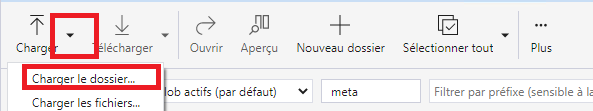

# Stockage Azure - Utilisateurs externes

## Explorateur de stockage 

1. Pour accéder aux différents services offerts, vous devez d'abord vous connecter à votre machine virtuelle. Voir [Connectez-Vous](ExtVirtualMachinesVirtuelles.md)

2. A partir de la machine virtuelle, vous serez en mesure d'accéder à votre espace de stockage en utilisant [l'Explorateur de stockage Azure](AzureStorageExplorer.md)

# Ingestion de fichier de données

## Tranfert de fichier Electroniques (TFE)
Pour certains cas d'utilisations, les données sensibles peuvent être transférées en utilisant TFE. Veuillez [nous contacter](ContactezNous.md) pour plus d'instructions si vous voulez recourir à ce service.

## Télécharger les données sur votre espace de stoackage
1. A partir de votre machine virtuelle, il est possible de télécharger des données directement  de certains liens. Exemples:
- statcan.gc.ca
- open.toronto.ca
2. Télécharger les données sur le disque local de votre machine virtuelle
3. Téléversez les données en utilisant [l'explorateur de stockage Azure](AzureStorageExplorer.md) dans l'espace de stockage de votre projet.

   
