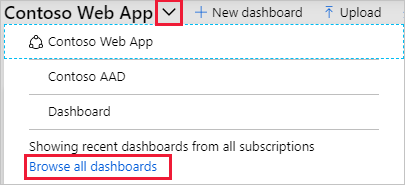
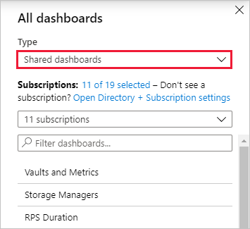

# Dashboards
Dashboards are a focused and organized view of your cloud resources in the Azure portal. They serve as a workspace where you can quickly launch tasks for day-to-day operations and monitor resources. Build custom dashboards based on projects, tasks, or user roles, for example.

The Azure portal provides a default dashboard as a starting point. You can edit the default dashboard. Create and customize additional dashboards, and publish and share dashboards to make them available to other users.

## Access Your Environment's Dashboard
1. From the Azure portal menu, select **Dashboard**. Your default view might already be set to dashboard.  
  
1. Select the arrow next to the dashboard name.  
1. Select your dashboard from the displayed list of dashboards. If the dashboard you want to open isn't listed:  
    a. Select **Browse all dashboards**.  
      
    b. In the **Type** field, select **Shared dashboards**.  
      
    c. Ensure the list of selected subsciptions includes the **vdl** subscription. You can also enter text to filter dashboards by name.  
    d. Select a dashboard from the list of shared dashboards.

**Note:** Please send a slack message to https://cae-eac.slack.com if you don't know the name of the dashboard that was created for your environment.

## Microsoft Documentation
https://docs.microsoft.com/en-us/azure/azure-portal/azure-portal-dashboards

