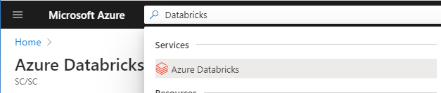
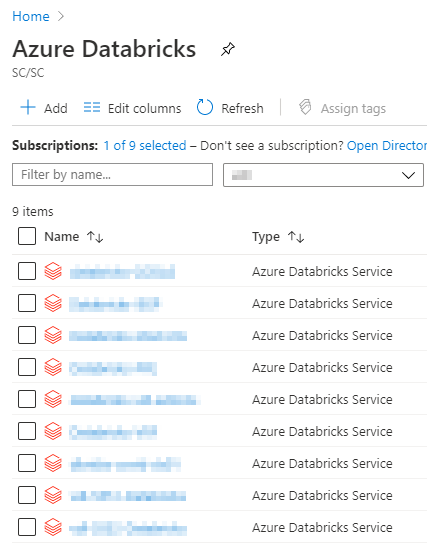
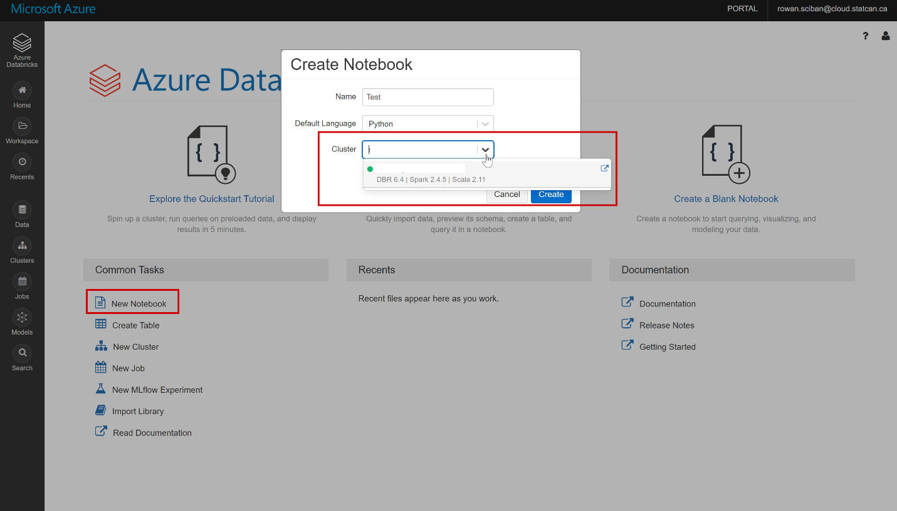
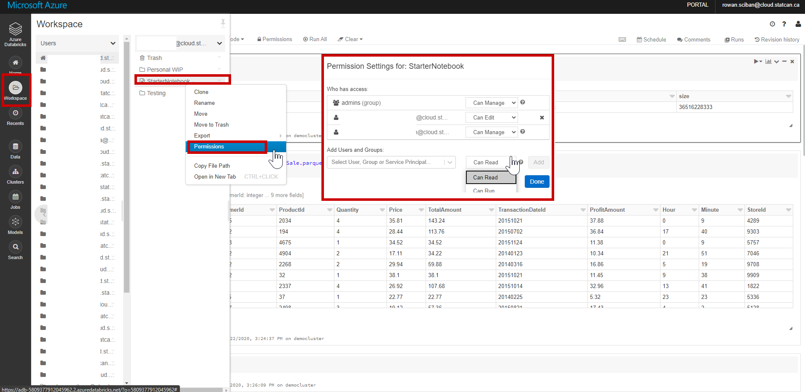
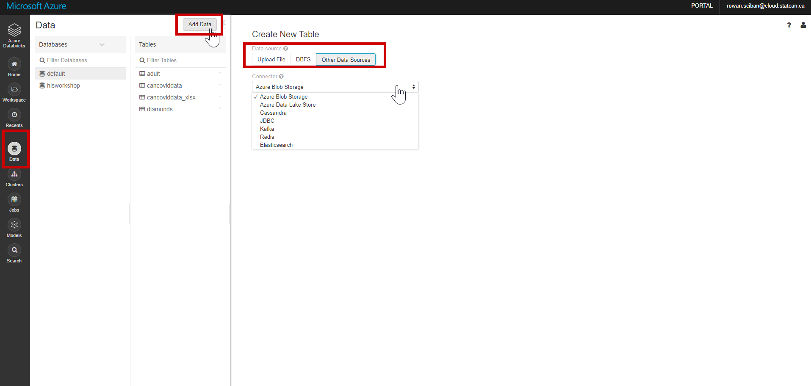
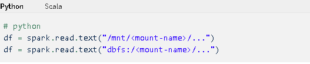
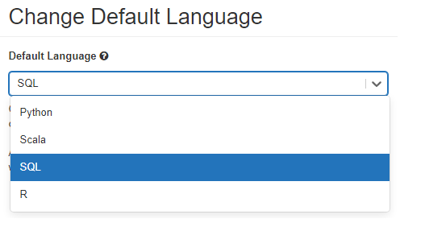
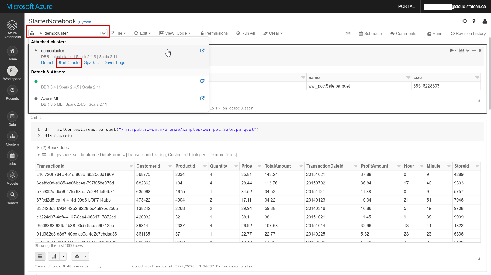

# Azure Databricks

## Accessing Databricks
### Dashboard
See the [Dashboard section](../Dashboard/Dashboards.md) of this documentation from more information.  
1. Click on the Dashboard menu from the Azure Portal.  
  

### Databricks URL
1. Navigate to https://canadacentral.azuredatabricks.net/, sign in with your cloud account credentials, and select the Databricks workspace that was created for you.  
 

### Azure Portal
1. In the Azure Portal Search box, search for **Databricks**.  
  
2. You should then see a list of the Databricks workspaces you were given permission to access.  

## Getting Started
Once inside Databricks you can create a new notebook or open an existing notebook. See [First Access to Databricks](https://docs.microsoft.com/en-us/azure/azure-databricks/quickstart-create-databricks-workspace-portal#run-a-spark-sql-job ) for more information.

## Creating a Cluster
Since you do not have permission to create a cluster, please send a slack message (https://cae-eac.slack.com) if a cluster has not been created for you or if you require changes to your cluster.

**Note:** You must have a cluster running before you can run code inside your notebook. See below or the [FAQ](FAQ.md) for information on how to start a cluster.

## Creating a Notebook 
 - One way to create a notebook is to click on the **New Notebook** link from the main Databricks page. You can then provide a name for your notebook and select the default notebook language.
 - From the available list of clusters, select the cluster to which you wish to attach your notebook.

 - To start or change a cluster from within a notebook, open the notebook and click on the cluster drop down found at the top right of the notebook. You can then start the cluster or detach it and attach a different one.  

## Sharing a Databricks Notebook
To share a notebook or invite other collaborators, right-click on a specific notebook file or folder from the Workspace menu, and select **Permissions**. You can also do this by clicking on the **Permissions** button from within a notebook. Once shared, multiple authors can participate in the same notebook session and co-author at the same time.  

**Note:** To add a user to the Databricks workspace, please send a slack message to https://cae-eac.slack.com.  



## Ingesting Data into Databricks
Data can be mounted or uploaded to the Databricks File System (DBFS), which is storage specific to the Databricks workspace. You can read data from a data source or even upload a data file (e.g. CSV) directly to the DBFS.

**Note:** The internal data lake container for your environment has already been mounted for you and you can work with the container directly. Please send a slack message to https://cae-eac.slack.com if you don't know the name of your mounted data lake container.

## Adding Data to Databricks


## Reading Mounted Files


Example:
```
%python
testData = spark.read.format('csv').options(header='true', inferSchema='true').load('/mnt/mad-du/incoming/age-single-years-2018-census-csv.csv')

display(testData)
```

## Changing Notebook Default Language



## Mixing Notebook Languages
You can override the default language by specifying the language magic command % at the beginning of a cell. The supported magic commands are: %python, %r, %scala, and %sql.

_Note:_  
When you invoke a language magic command, the command is dispatched to the REPL in the execution context for the notebook. Variables defined in one language (and hence in the REPL for that language) are not available in the REPL of another language. REPLs can share state only through external resources such as files in DBFS or objects in object storage.    

Notebooks also support a few auxiliary magic commands:  
%sh: Allows you to run shell code in your notebook. To fail the cell if the shell command has a non-zero exit status, add the -e option. This command runs only on the Apache Spark driver, and not the workers. To run a shell command on all nodes, use an init script.  
%fs: Allows you to use dbutils filesystem commands.  
%md: Allows you to include various types of documentation, including text, images, and mathematical formulas and equations.  

## Starting a Databricks Cluster
1. Click on the cluster drop-down list.
2. Select a cluster from the list.
3. Click on the **Start Cluster** link.  
  

## Microsoft Documentation  
- [First Access to Databricks](https://docs.microsoft.com/en-us/azure/azure-databricks/quickstart-create-databricks-workspace-portal#run-a-spark-sql-job)  
- [For more information on Databricks](https://azure.microsoft.com/en-us/resources/videos/connect-2017-introduction-to-azure-databricks)  
- [Install Libraries in Current Notebook Session](https://docs.microsoft.com/en-us/azure/databricks/notebooks/notebooks-python-libraries)  
- [Library Management for Admins](https://docs.microsoft.com/en-us/azure/databricks/libraries#:~:text=Azure%20Databricks%20supports%20three%20library,its%20path%20in%20the%20workspace)  
