# Azure Data Factory (ADF)

## Access Data Factory
### Dashboard
See the [Dashboard section](../Dashboard/Dashboards.md) of this documentation from more information.  
1. Click on the Dashboard menu from the Azure Portal.  
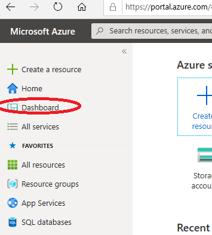  

### ADF URL
1. Navigate to https://adf.azure.com, and select the Data Factory instance that was created for you.  
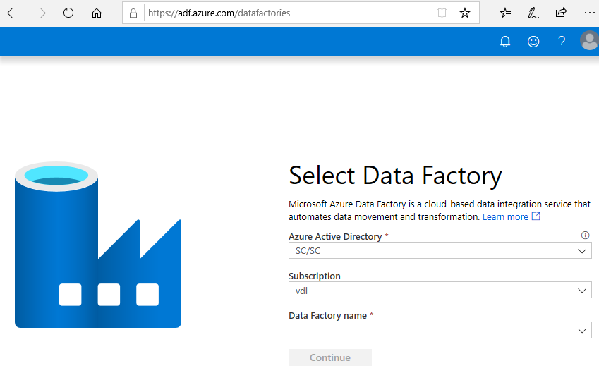 

### Azure Portal
1. In the Azure Portal Search box, search for **Data factories**.  
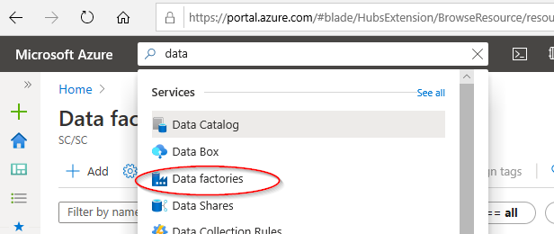  
2. You should then see a list of the Data Factories you were given permission to access.  
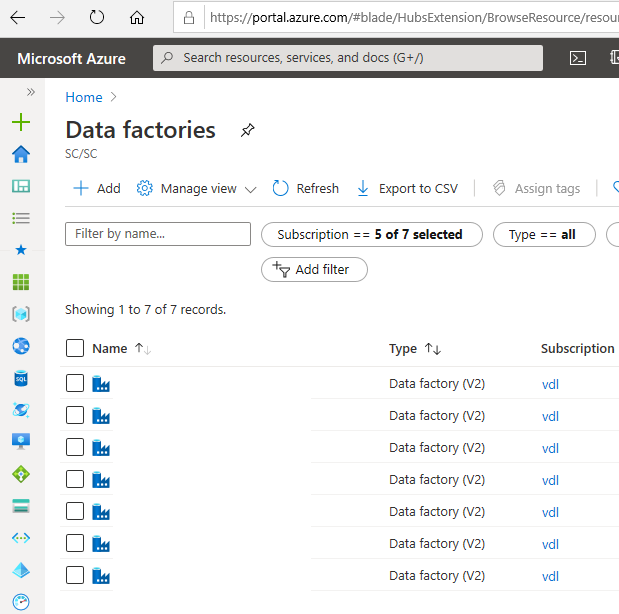    

## Authoring
Click on **Author and Monitor**.  
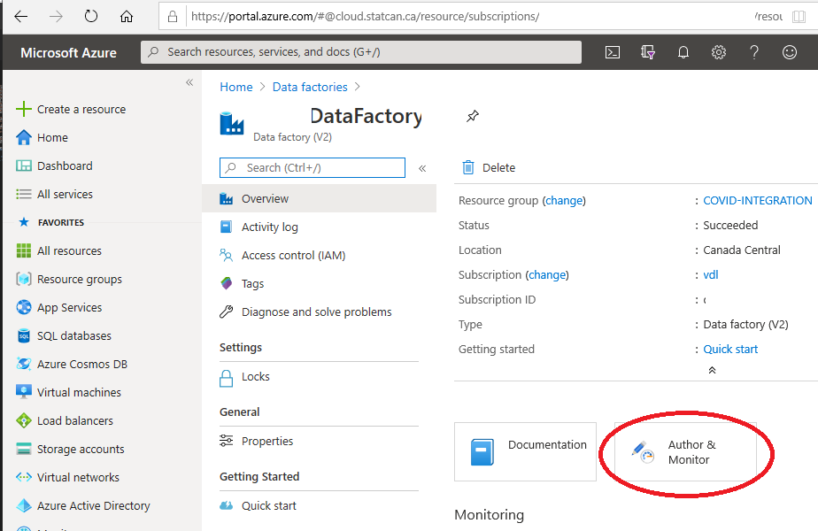  

In Data Factory, you have the ability to author and deploy resources.     
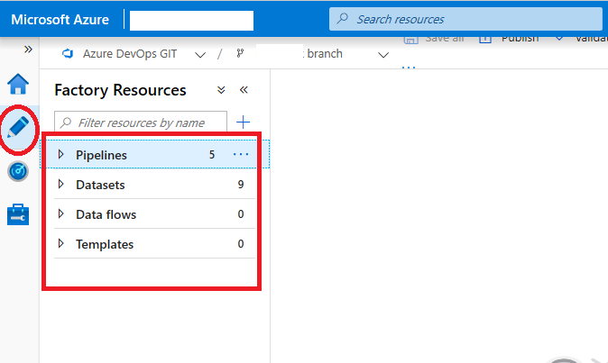  
See [Visual authoring in Azure Data Factory](https://docs.microsoft.com/en-us/azure/data-factory/author-visually) for more information.  

You can also use some of the various wizards provided on **Data Factory Overview** page.

**NOTE:** Configuring SSIS Integration is **NOT** recommended. Contact the support team through the https://cae-eac.slack.com channel if you have questions.

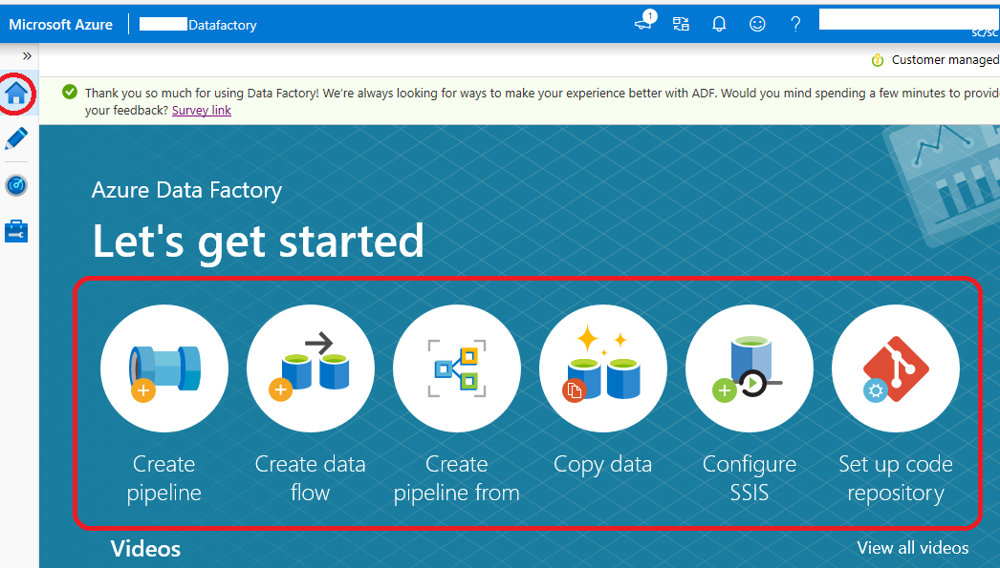  
See [Azure Documentation Tutorials](https://docs.microsoft.com/en-us/azure/data-factory/introduction) for more details.  

## Access the Data Lake from ADF
A Data Lake connection has been pre-configured for your environment.   
1. Click on **Manage**.  
2. Click on **Linked Services**.  
3. The linked service with the **Azure Data Lake Storage Gen2** type is your _Data Lake_.  
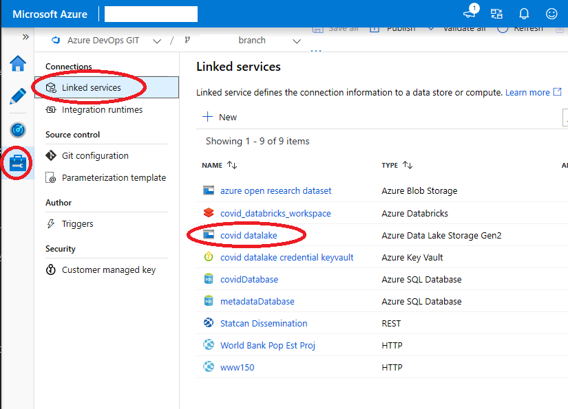  

Note: You have been granted access to specific containers created in the Data Lake for your environment.

## Access Azure SQL Database
Some projects have an Azure SQL Database instance.  
1. Click on **Manage**.  
2. Click on **Linked Services**.  
3. The linked service(s) with the **Azure SQL Database** type is / are your _Database(s)_  
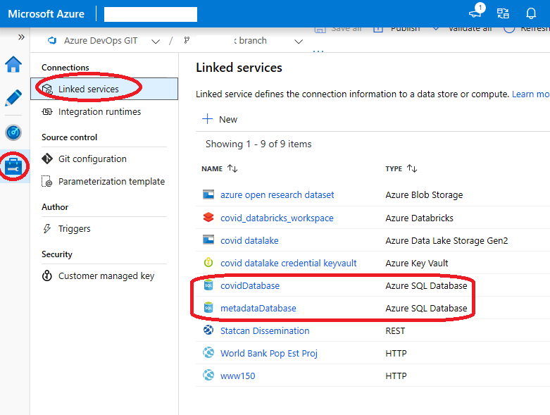

## Save / Publish Your Data Factory Resources
Azure Data Factory can be configured to save your work to the following locations:  
1. Git repository 
2. Publish directly to Data Factory

### Git (when supported)
When Git is enabled you can see your configuration and save your work to a specific branch.  
1. Click on **Manage**  
2. Click on **Git Configuration**.  
3. See the Git configuration that was setup for you:   
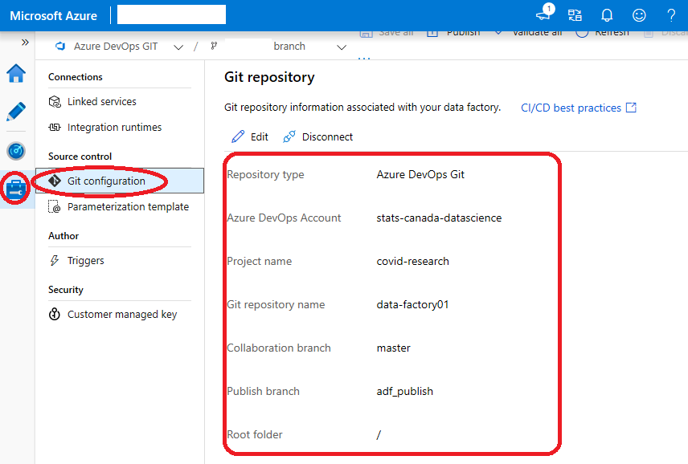  
4. When authoring a workflow it can be saved to your branch. Click on **+ New branch** from this branch dropdown to create a new feature branch.   
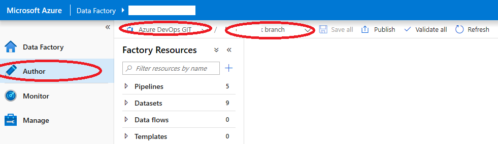  
5. When you are ready to merge the changes from your feature branch to your collaboration branch (master), click on the branch dropdown and select **Create pull request**. This action takes you to Azure DevOps Git Repo where you can create pull requests, do code reviews, and merge changes to your collaboration branch (master) after the pull request has been approved.  
6. After you have merged changes to the collaboration branch (master), click on Publish to publish your code changes from the master branch to Azure Data Factory. Contact the support team through the https://cae-eac.slack.com channel if you receive an error when trying to Publish.  
### Data Factory Service
When Data Factory is not integrated with source control your workflows are stored directly in the Data Factory service and you cannot save partial changes, you can only **Publish all** which overwrites the current state of the Data Factory with your changes, which are then visible to everyone.    
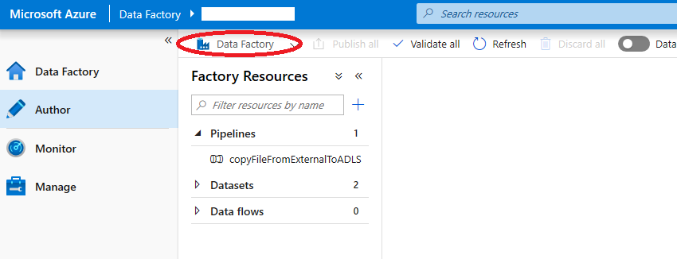

## Ingest and Transform Data with ADF 
- [Copy Data Wizard](https://docs.microsoft.com/en-us/azure/data-factory/quickstart-create-data-factory-copy-data-tool#start-the-copy-data-tool) 
- [Mapping Data Flows – GUI-driven ETL](https://docs.microsoft.com/en-us/azure/data-factory/tutorial-data-flow#create-a-pipeline-with-a-data-flow-activity )

## Example: How to connect John Hopkins Data
1. There is an example workflow that shows how to ingest data from GitHub using a Data Factory Pipeline.  
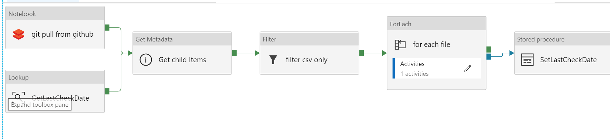  
2. Data can be filtered from within Data Factory.  

3. Alternatively, data can be pulled from GitHub using code in a Databricks notebook.  
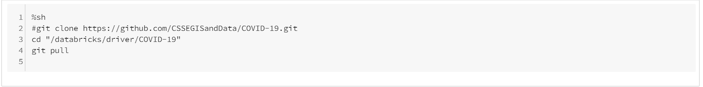

## Microsoft Documentation
- [Introduction to Azure Data Factory - Azure Data Factory](https://docs.microsoft.com/en-us/azure/data-factory/introduction)  
- [Create an Azure data factory using the Azure Data Factory UI - Azure Data Factory ](https://docs.microsoft.com/en-us/azure/data-factory/quickstart-create-data-factory-portal)  
- [Copy data by using the Azure Copy Data tool - Azure Data Factory](https://docs.microsoft.com/en-us/azure/data-factory/quickstart-create-data-factory-copy-data-tool)  
- [Create a mapping data flow - Azure Data Factory](https://docs.microsoft.com/en-us/azure/data-factory/data-flow-create)  
- [Expression functions in the mapping data flow - Azure Data Factory](https://docs.microsoft.com/en-us/azure/data-factory/data-flow-expression-functions)  
- [Mapping data flow Debug Mode - Azure Data Factory](https://docs.microsoft.com/en-us/azure/data-factory/concepts-data-flow-debug-mode)  
- [Mapping data flow Visual Monitoring - Azure Data Factory](https://docs.microsoft.com/en-us/azure/data-factory/concepts-data-flow-monitoring)  

## YouTube Videos
- [Ingest, prepare & transform using Azure Databricks & Data Factory | Azure Friday](https://www.youtube.com/watch?v=CZQOxPY7UuA)  
- [Azure Friday | Visually build pipelines for Azure Data Factory V2](https://www.youtube.com/watch?v=uS8xyqHql5I&t=4s)  
- [How to prepare data using wrangling data flows in Azure Data Factory | Azure Friday](https://www.youtube.com/watch?v=LKenBZYZaLA)  
- [How to develop and debug with Azure Data Factory | Azure Friday](https://www.youtube.com/watch?v=9tg5Rsoi5ic)  
- [Building Data Flows in Azure Data Factory](https://www.youtube.com/watch?v=kcsRrWT0hjU)  
  
