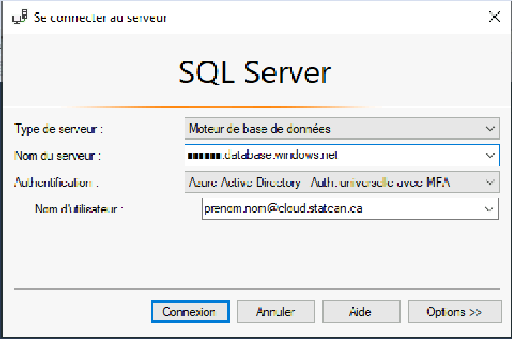

# FAQ 

## Storage Explorer

### How do I ingest data into the platform?
1. Files may be uploaded into an external storage account, as documented in [Azure Storage Explorer](StorageExplorer.md). These files will then automatically be moved into an internal storage account (Data Lake), and made accessible from authorized services.
2. Platform tools such as Databricks or Data Factory may be used to ingest data from public data sources.

### How do I configure Azure Storage Explorer proxy settings on a network B VDI?
_For Statistics Canada Employees only_
1. Proxy configuration is required if you receive the following error:  
  
1. In Azure Storage Explorer, go to **Edit** --> **Proxy Settings**. Enter the necessary proxy settings, and click on **OK**.  
  

### How do I request a new SAS token (required for Azure Storage Explorer on a Network B VDI)?
_For Statistics Canada Employees only_

Please contact the support team through the https://cae-eac.slack.com channel to request a temporary SAS token.

### Why do I get an error message when accessing the internal Data Lake?
The internal Data Lake is only accessible from within a VM in the Collaborative Analytics Environment (CAE). It is not accessible from your personal or work laptop, Network B VDI or other cloud VM.

## Source Code Control

### How do I link my Visual Studio Subscription to my StatCan cloud account?
1. Login to https://visualstudio.microsoft.com/subscriptions/ with your organization's email address. For StatCan employees, this will be your canada.ca email address.  
.  
2. Add your cloud account as an alternate account.  This will allow you to use your licenses for Visual Studio & Azure DevOps in the CAE.  

**For Statistics Canada employees:**  If you do not have a Visual Studio Subscription, please consult your supervisor. If they decide that a subscription is needed, they can then contact StatCan Software Asset Management by submitting an SRM to request a license on your behalf.

## Virtual Machines

### What do I do if I have forgotten the password for my virtual machine?
If you forget the password of your virtual machine you can delete then recreate your virtual machine. Unfortunately, you will lose any data and software on your old machine.

### What do I do if I need to run a long running job on my virtual machine?
Machines are shut down every day at 7pm EST in order to reduce costs. If you have a long-running job, it is recommended that you use Databricks or Data Factory.

**WARNING:** Disabling Auto-shutdown is **not** recommended as it can incur significant costs.  
To disable Auto-shutdown:  
1. Navigate to your virtual machine in the Azure Portal.
2. Disable Auto-shutdown.  
  

### How do I request changes to my virtual machine?
If the virtual machine you are currently using does not meet your requirements, please contact the support team through the https://cae-eac.slack.com channel. 

## Databricks

### Why am I unable to run code from my Databricks notebook?
You must first start a Databricks cluster that was previously created for you:
1. Click on Clusters.  
2. Navigate to your cluster and click on the **Start** (arrow) button.  

## Other

### How do I connect to the internal data lake with Power BI Desktop?
Prerequisites:
1. A VM in the Collaborative Analytics Environment (CAE).
1. Power BI Desktop. (Available by default in the Windows Data Science Virtual Machine images.)

Steps:
1. Login to your CAE VM.  
1. Launch Power BI Desktop.  
1. Follow the steps in [Analyze data in Azure Data Lake Storage Gen2 by using Power BI - Create a report in Power BI Desktop](https://docs.microsoft.com/en-us/power-query/connectors/datalakestorage#create-a-report-in-power-bi-desktop). Please send a slack message to https://cae-eac.slack.com if you don't know the Azure Data Lake Storage Gen2 URL. 

### How do I connect to an Azure SQL Database?
Prerequisites:
1. A VM in the Collaborative Analytics Environment (CAE).
1. SQL Server Management Studio or another tool such as Power BI Desktop. (These tools are available by default in the Windows Data Science Virtual Machine images.)

Steps:
1. Login to your CAE VM.  
1. Launch a tool such as SQL Server Management Studio.  
1. Enter your SQL Server server Name.  
  
1. Enter the database name.  
  

### How do I add a FAQ?
Please send your suggestion through the https://cae-eac.slack.com channel.
