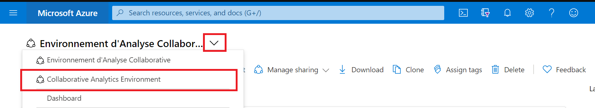
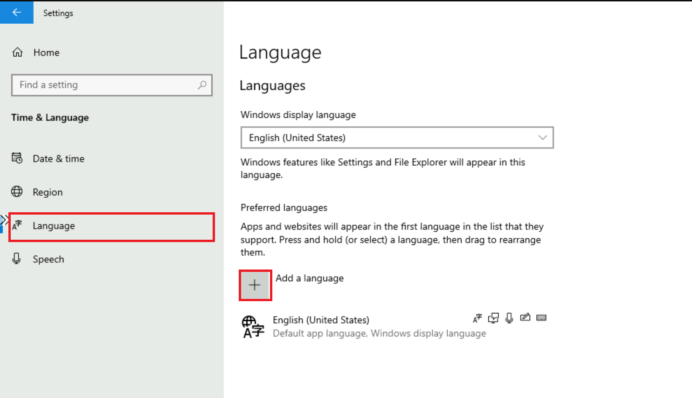
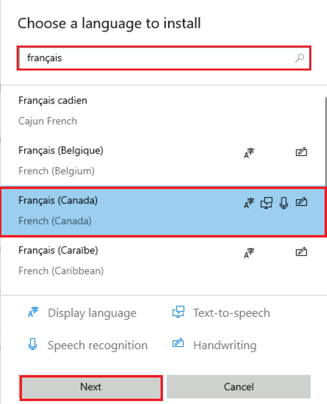
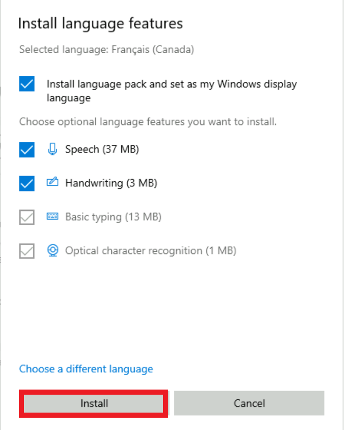
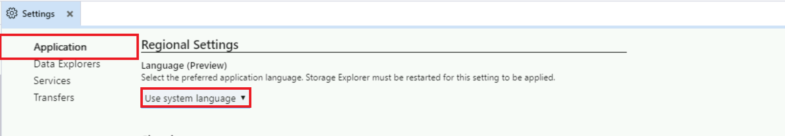
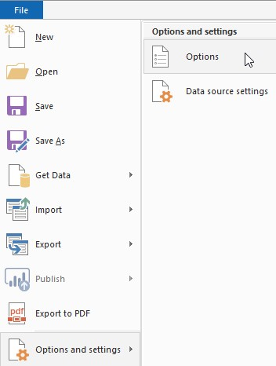
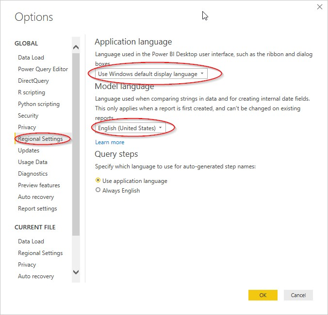

# Language 
The document describes how to change languages in the various service offerings.

## Azure portal
To change the language settings of the Azure portal:

1. Click on the **Settings** menu in the global page header.
2. Click on the **Language & region tab**.
3. Use the drop-downs to choose the language and the regional format to meet your own preferences.
4. Select **Apply** to update your language and regional format settings.

  

## Dashboard
To select the English dashboard of the Collaborative Analytics Environment (CAE):

1. From the dashboard view, select the arrow next to the dashboard name.
2. Select the **Collaborative Analytics Environment** dashboard from the displayed list of dashboards. **Note:** If the dashboard is not listed, select **Browse all dashboards** to access the complete list.

  

## DataFactory
This tool is only available in english for now.

## Databricks
This tool is only available in english for now.

## Virtual Machines
### Windows Server
To configure a Windows virtual machine display language:

1.	Start the **Settings** application. 
  

2.	Select **Time & Language**.
  
 
3.	Select **Language**, then under the **Preferred languages** heading, select **Add a language**. 
  

4.	In the **Choose a language to install** dialog box, select the language pack to meet your preferences, and then select **Next**.
  
 
5.	In the **Install language features** dialog box, select **Install**. 
  
 
6.	The Windows display language box should now include the newly added language. To switch to the new language, select it from the Windows display language box, sign out of the current Windows session, and then sign back in.

### Ubuntu Server
To configure an Ubuntu virtual machine display language, see [Language settings](https://help.ubuntu.com/stable/ubuntu-help/prefs-language-install.html.en).

## Machine Learning
To change the language settings of the Microsoft Azure Machine Learning workspace:

1. Click on the **Settings** menu in the global page header.

2. Under the **Language and formats** heading, use the drop-downs to choose the language and the regional format to meet your own preferences.

3.	Select **Apply** to update your language and regional format settings.

 

## Slack
To change the language settings of the Slack application:

1.	Click on the **profile icon** in the global page header.

2.	Click on **Preferences**.

  

3.	Select the **Language & region** tab.

4. Under the **Language** heading, use the drop-down to choose the language to meet your preference.

  

5. Close the **Preferences** window.

## Microsoft Azure Storage Explorer

By default, the application detects your language based on the language preferences on your computer. 

To change the language settings on Microsoft Azure Storage Explorer:

1.	Click on **Edit**.

2.	Click on **Settings**. 

 

3.	In the Settings page, select **Application**, then under the **Regional Settings** heading, use the drop-down to choose the language to meet your preference.  

 

4.	To switch to the new language, close the application, then restart it again.

## Power BI

More information is also available in [Supported languages and countries/regions for Power BI](https://docs.microsoft.com/en-us/power-bi/fundamentals/supported-languages-countries-regions).

### Power BI Service

By default, the Power BI Service detects your language based on the language preferences on your computer. The way you access and change these preferences may vary depending on your operating system and browser.

To switch the Menu Language in the Power BI Service:

1.	In the Power BI service, click on the **Settings icon**, and select **Settings**.

  

2.	On the **General** tab, select **Language**.

   

3.	Select your language, and click on **Apply**.

See [Languages for the Power BI service](https://docs.microsoft.com/en-us/power-bi/fundamentals/supported-languages-countries-regions#languages-for-the-power-bi-service) for more details.

### Power BI Desktop

By default:

•   The **Application language** is based on the **Windows language**

•	The **Model language** is based on the **Application language**

•	The **Query steps** are based on the **Application language**

Setting the **Model language** to **English (United States)** is recommended.

The model language only applies **when the report is first created**, and **cannot be changed** on existing reports. Thus, setting the language model to **US English** is recommended, unless you have a specific need to use another language for the report model. String comparisons and internal date fields are affected by this setting.

To switch the Menu Language & Model Language in Power BI Desktop:

1.	Open the **Options** menu.

   

2.	Under **GLOBAL**, click on **Regional Settings**, and set the **Application language** and **Model language** to the desired language.

    

**NOTE**: The **Import language** is set separately in the **CURRENT FILE** section **Regional Settings**. You only need to change this if you import data files that have numbers and dates in a specific locale (e.g., English Canada DD/MM/YYYY, English US MM/DD/YYYY).

## Web Browsers

* [Chrome](https://support.google.com/chrome/answer/173424?co=GENIE.Platform%3DDesktop&hl=en)
* [Safari](https://support.apple.com/en-ca/guide/mac-help/mh26684/mac)
* [Edge](https://support.microsoft.com/en-US/microsoft-edge/use-microsoft-edge-in-another-language-4da8b5e0-11ce-7ea4-81d7-4e332eec551f)
* [Firefox](https://support.mozilla.org/en-US/kb/use-firefox-another-language)
* [Opera](https://help.opera.com/en/latest/customization/#changeLanguage)

