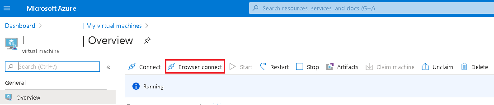

# Virtual Machines

## Find Your DevTest Lab
1. In your project's custom Dashboard in the Azure Portal, click on the DevTest Lab.    
  

## Create Your Virtual Machine
**Note:** In some instances a Virtual Machine will be pre-created for you and you will not have permission to create a virtual machine. See the [FAQ](FAQ.md) if you need to make changes to your virtual machine.  

1. From the DevTest Lab **Overview** page, click on the **+ Add** button.  
2. Choose an appropriate base for your VM (e.g., Data Science Virtual Machine - Windows Server 2019). For more details on the software included with the Data Science Virtual Machines, please [click here]( https://docs.microsoft.com/en-us/azure/machine-learning/data-science-virtual-machine/tools-included ).  
3. Enter a name for your VM and a User name and password that you will use to login to the VM. Be sure to deselect the *Use a saved secret* and *Save as default password* checkboxes. Leave the rest as defaults and click on the **Create** button.    
  

## Find Your Virtual Machine
1. From the DevTest Lab **Overview** page, scroll down until you see your VM under **My virtual machines**. Click on your VM to access its **Overview** page.  

## Start Your Virtual Machine
1. From the **Overview** page for your VM, click on the **Start** button.  
  
2. It takes a few minutes for your VM to start up. Monitor its startup progress by selecting the Notifications icon at the top right of the window.   
  

## Connect To Your Virtual Machine
1. From the **Overview** page for your VM, click on the **Browser connect** button (if you do not see a **Browser connect** button you might have to click on the **Connect** button and then choose **Bastion** from the dropdown menu).  
    
2. Ensure the *Open in new window* checkbox is selected, enter the Username and Password that you used when you created your VM, and click on the **Connect** button. Your VM should open in a new browser tab.
   
## Stop Your Virtual Machine
Virtual machines only incur costs while they are running. You should shut down your virtual machine when not in use to prevent unneccessary charges.
1. From the **Overview** page for your VM, click on the **Stop** button.  
  
