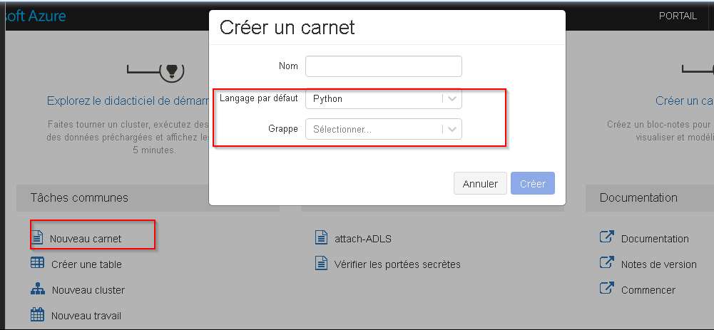
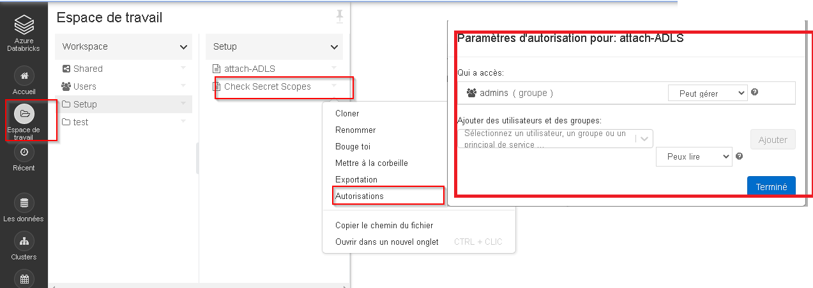
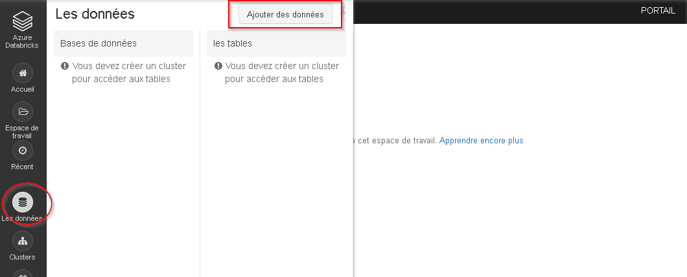
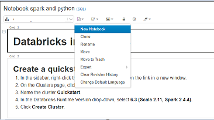
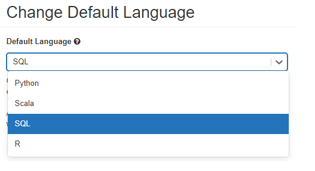
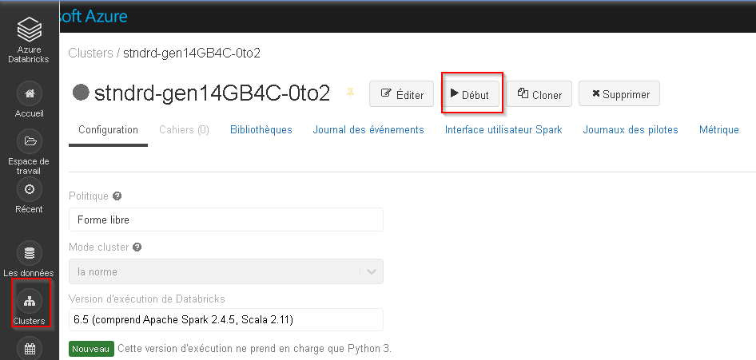

# Azure Databricks

## Accès à Databricks

### Tableau de bord

Consultez la [section Tableau de bord](../Dashboard/Dashboards.md)
de cette documentation pour obtenir de plus amples renseignements.

1. Cliquez sur le menu Tableau de bord dans le portail Azure.

### Adresse URL de Databricks

1.  Rendez-vous au site https://canadacentral.azuredatabricks.net/, ouvrez une session en utilisant vos justificatifs d'identité de compte en nuage et sélectionnez l'espace       de travail Databricks qui a été créé pour vous.

 

### Portail Azure

1.  Dans la boîte de recherche du portail Azure, recherchez **Databricks**.

 

2.  Vous devriez alors voir une liste des espaces de travail Databricks auxquels vous pouvez accéder.

 

 ## Commencer
Une fois dans Databricks, vous pourrez créer un carnet ou ouvrir un carnet existant. Pour plus d'information, veuillez consulter le processus à suivre pour [accéder à  Databricks pour la première fois](https://docs.microsoft.com/fr-ca/azure/databricks/scenarios/quickstart-create-databricks-workspace-portal?tabs=azure-portal#run-a-spark-sqljob).

## Création d'un cluster
Si aucun cluster n'a été créé pour vous ou si vous avez besoin d'apporter des changements à votre cluster, vous devrez envoyer un message sur Slack (https://cae-eac.slack.com), puisque vous n'avez pas la permission de créer un cluster.

**Note :** Vous devez avoir un cluster actif avant de pouvoir exécuter le code dans votre carnet. Pour obtenir des renseignements sur la façon de créer un cluster, consultez la section ci-dessous ou la [FAQ](FAQ.md).

## Création d'un carnet

-   Une façon de créer un carnet consiste à cliquer sur l'option **Nouveau carnet** depuis la page principale de Databricks. Vous pouvez ensuite nommer votre carnet et           choisir le langage par défaut.
-   Dans le champ « Grappe », sélectionnez parmi la liste proposée le cluster auquel vous souhaitez attacher votre carnet. 
   
-   Pour commencer un cluster ou le modifier à partir d'un carnet, ouvrez le carnet et, dans le coin supérieur droit, cliquez sur le menu déroulant pour cluster. Vous pourrez     alors démarrer le cluster ou le détacher et en attacher une autre.

## Partage de carnets dans Databricks
Pour partager un carnet ou inviter d'autres collaborateurs : depuis le menu Espace de travail, faites un clic droit sur le fichier ou le dossier du carnet souhaité et sélectionnez l'option **Autorisations**.Vous pouvez également le faire à partir d'un carnet, en cliquant sur le bouton **Autorisations**. Une fois que le carnet aura été partagé,plusieurs auteurs pourront le consulter et le modifier simultanément.

**Note :** Pour ajouter un utilisateur à l'espace de travail Databricks,
veuillez envoyer un message Slack sur https://cae-eac.slack.com.

## Ingestion de données dans Databricks
Les données peuvent être montées ou téléversées dans le Système de fichiers Databricks (DBFS), qui est un espace de stockage propre à l'espace de travail Databricks. Vous pouvez lire des données d'une source de données ou même téléverser un fichier de données (p. ex. CSV) directement dans le DBFS.

**Note :** Le conteneur interne de lac de données pour votre environnement a déjà été monté pour vous, et vous pouvez travailler directement avec le conteneur. Si vous ne connaissez pas le nom de votre conteneur de lac de données, veuillez envoyer un message Slack sur https://cae-eac.slack.com.

## Ajout de données dans Databricks

## Lecture de fichiers montés

Exemple :

    %python
    testData = spark.read.format('csv').options(header='true', inferSchema='true').load('/mnt/mad-du/incoming/age-single-years-2018-census-csv.csv')

    display(testData)

## Modification du langage par défaut dans un carnet

## Utilisation de plusieurs langages dans un carnet
Vous pouvez contourner les paramètres de langage par défaut en entrant la commande Magic Language % au début d'une cellule. Les commandes Magic
prises en charge sont les suivantes : %python, %r, %scala et %sql.

*Note :*
Lorsque vous utilisez une commande Magic Language, celle-ci est distribuée à la valeur REPL dans le contexte d'exécution du carnet. Lesvariables définies dans un langage (et par conséquent dans la REPL pour ce langage) ne sont pas offertes dans la valeur REPL d'un autre langage. Les valeurs REPL permettent de partager l'état uniquement par
l'intermédiaire de ressources externes, telles que des fichiers dans le DBFS ou des objets stockés.
Les carnets prennent également en charge quelques commandes Magic auxiliaires :

* Vous permet d'exécuter du code Shell dans votre carnet. Pour faire échouer la cellule si la commande Shell a un état de sortie différent de zéro, ajoutez l'-e option. Cette commande s'exécute uniquement sur le pilote Apache Spark, et non sur les processus de travail. Pour exécuter une commande Shell sur tous les nœuds, utilisez un script d'initialisation (script init).

* Vous permet d'utiliser des commandes de type système de fichiers (dbutils).

* Vous permet d'inclure différents types de documentation, notamment du texte, des images ainsi que des formules et des équations mathématiques.

## Démarrage de clusters dans Databricks

1.  Cliquez sur la liste déroulante de clusters.

2.  Sélectionnez un cluster à partir de cette liste.

3.  Cliquez sur le bouton **Début** pour démarrer le cluster.

4.  

## Documentation Microsoft

-   [Accéder à Databricks pour la première fois](https://docs.microsoft.com/fr-ca/azure/databricks/scenarios/quickstart-create-databricks-workspace-portal)

-   [En savoir plus sur Databricks](https://azure.microsoft.com/fr-ca/resources/videos/connect-2017-introduction-to-azure-databricks/)
    (en anglais seulement)

-   [Installer des bibliothèques dans la session active d'un carnet](https://docs.microsoft.com/fr-ca/azure/databricks/notebooks/notebooks-python-libraries)

-   [Gestion des bibliothèques pour les administrateurs](https://docs.microsoft.com/frca/azure/databricks/libraries)
