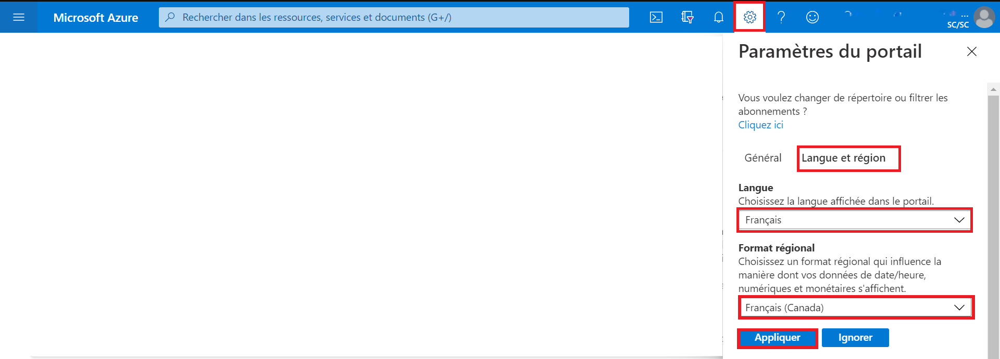
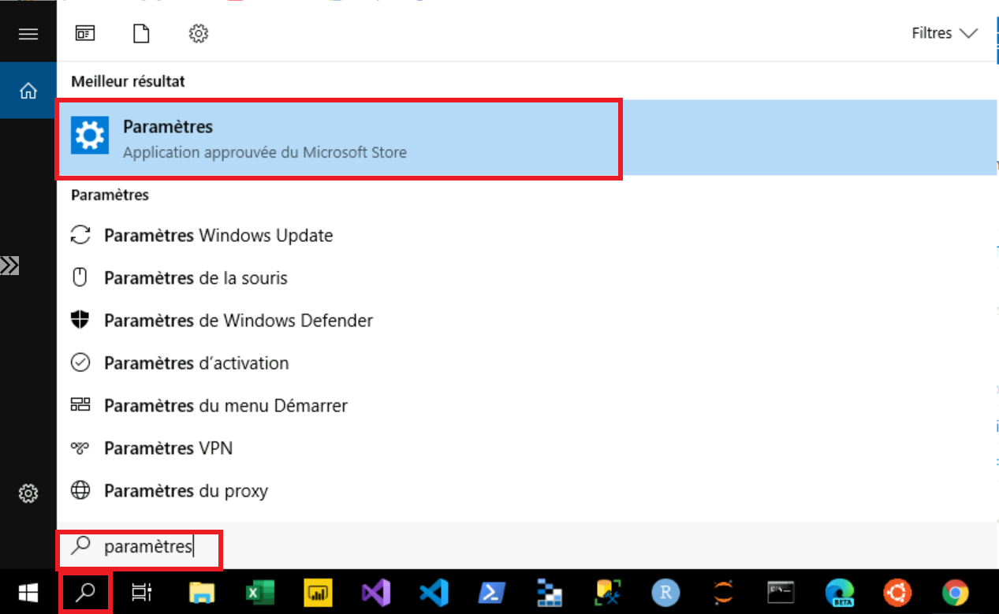
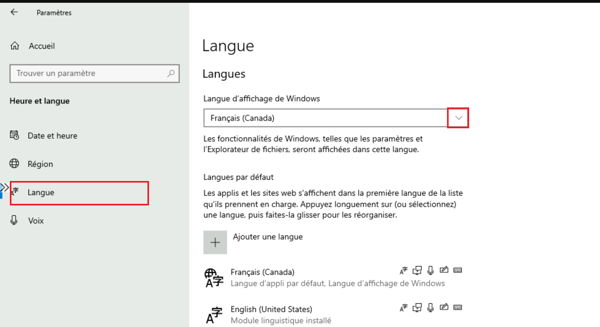
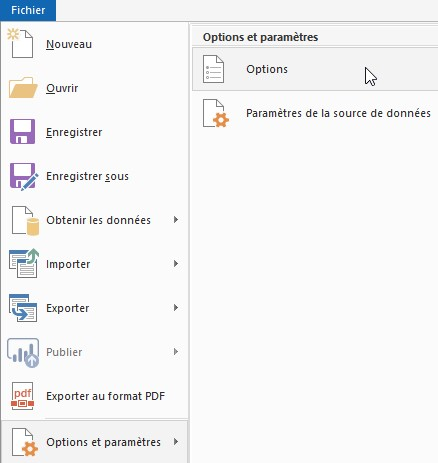

# Langue
Le document décrit comment changer de langue dans les différentes offres de services.

## Portail Azure
Pour modifier les paramètres de langue du portail Azure:

1. Sélectionnez le menu **Paramètre**s dans l'en-tête de la page principale.
2. Sélectionnez l'onglet **Langue et région**.
3. Utilisez les menus déroulants pour choisir la langue et le format régional selon vos préférences.
4. Cliquez sur le bouton **Appliquer** pour mettre à jour vos paramètres de langue et de format régional.

 

## Tableau de bord
Pour accéder au tableau de bord en français de l’environnement d’analyse collaborative (EAC):

1.	A partir de la page principale des tableaux de bords, sélectionnez la flèche à côté du nom du tableau de bord.
2.	Sélectionnez le tableau de bord intitulé **Environnement d’Analyse Collaborative** dans la liste affichée. **Note:** Si ce tableau de bord n'est pas dans la liste, sélectionnez **Parcourir tous les tableaux de bord** pour accéder à la liste complète de tous les tableaux de bord.

 

## DataFactory
Cet outil n’est disponible qu'en anglais pour le moment.

## Databricks
Cet outil n’est disponible qu'en anglais pour le moment.

## Machine Virtuelles
### Serveur Windows
Pour configurer la langue d'affichage d'une machine virtuelle Windows:

1.	Démarrez l'application **Paramètres**.

2. Sélectionnez **Heure et langue**.

  
3. Sélectionnez **Langue**, puis utiliser le menu déroulant sous l'en-tête **Langue d’affichage de Windows** pour choisir la langue désirée.  

4. La zone de langue d'affichage de Windows doit maintenant inclure la langue choisie. Pour appliquer la nouvelle langue, déconnectez-vous de la session Windows actuelle, puis reconnectez-vous.

### Serveur Ubuntu
Pour configurer la langue d'affichage d'une machine virtuelle Ubuntu, voir [Paramètres de langue](https://help.ubuntu.com/stable/ubuntu-help/prefs-language-install.html.fr).

## Machine Learning
Pour modifier les paramètres de langue de l’espace de travail Microsoft Azure Machine Learning:

1. Sélectionnez le menu **Paramètres** dans l'en-tête de la page principale.

2. Sous l’onglet **Langue et formats**, utilisez les menus déroulants pour choisir la langue et le format régional selon vos préférences.

3. Cliquez sur le bouton **Appliquer** pour mettre à jour vos paramètres de langue et de format régional.

## Slack

Pour modifier les paramètres de langue de l’application Slack:
1. Cliquez sur l’**icône de profile** dans l'en-tête de la page principale.

2.  Cliquez sur **Préférences**.

  
 
4.	Sélectionnez l’onglet **Langue et région**.

5.	 Sous l’entête **Langue**, utilisez le menu déroulant pour choisir la langue selon votre préférence.  

 

4. Fermez la fenêtre de **Préférences**.

## Microsoft Azure Storage Explorer

Par défaut, l'application détermine la langue utilisée en fonction des préférences linguistiques définies sur l'ordinateur.

Pour modifier les paramètres de langue dans Microsoft Azure Storage Explorer:

1.	Cliquez sur **Modifier**.

2.	Cliquez sur **Paramètres**.

 

3.	Dans la fenêtre Paramètres, sélectionnez **Application**, puis utiliser le menu déroulant sous l’entête **Paramètres régionaux** pour choisir la langue de préférence. 

 

4.	Pour appliquer la nouvelle langue, fermez puis relancer l’application.

## Power BI

Veuillez voir [Langues et pays/régions pris en charge pour Power BI](https://docs.microsoft.com/fr-fr/power-bi/fundamentals/supported-languages-countries-regions) pour des détails additionnels

### Service Power BI

Par défaut, Power BI détermine la langue utilisée en fonction des préférences linguistiques définies sur votre ordinateur. La méthode à suivre pour afficher et modifier ces préférences peut varier selon votre système d’exploitation et votre navigateur.

Pour changer la langue du menu dans le service Power BI:

1.	Dans le service Power BI, cliquez sur l’**icône Paramètres**, et sélectionnez **Paramètres**.

  

2.	Sous l’onglet **Général**, sélectionnez **Langue**.

  

3.	Sélectionnez votre langue, et cliquez sur **Appliquer**.

Veuillez voir [Langues disponibles pour le service Power BI](https://docs.microsoft.com/fr-fr/power-bi/fundamentals/supported-languages-countries-regions#languages-for-the-power-bi-service) pour des détails additionnels.

### Power BI Desktop

Par défaut:

•	La **Langue de l'application** est basée sur la **Langue de Windows**

•	La **Langue du modèle** est basée sur la **Langue de l'application**

•	La **Langue des étapes** la requête est basée sur la **Langue de l'application**

Il est recommandé de sélectionner **English (United States)** comme Langue du modèle.

La langue du modèle s'applique seulement **lorsque le rapport est créé**, et elle **ne peut pas être changée** dans un rapport existant. Donc, il est recommandé de mettre la langue du modèle à **US English**, sauf si vous avez un besoin spécifique (les comparaisons de chaîne de caractères et champs de date internes sont affectés par cette option.)

Pour changer la langue du menu et la langue du modèle dans Power BI Desktop:

1.	Ouvrez le menu **Options**.

     

2.	Sous **GLOBAL**, cliquez sur **Paramètres régionaux**, et sélectionnez la **langue de l’application** et la **langue du modèle** désirées.

   

**NOTE**: La **langue d'importation** des données peut être changée séparément dans les **Paramètres régionaux** de la section **FICHIER ACTIF**. Vous avez seulement besoin de la changer si vous importez des données qui ont des nombres ou des dates dans une autre langue (p. ex. Anglais Canada DD/MM/YYYY, Anglais US MM/DD/YYYY).

## Explorateurs Internet

* [Chrome](https://support.google.com/chrome/answer/173424?co=GENIE.Platform%3DDesktop&hl=fr)
* [Safari](https://support.apple.com/fr-ca/guide/mac-help/mh26684/mac)
* [Edge](https://support.microsoft.com/fr-fr/microsoft-edge/utiliser-microsoft-edge-dans-une-autre-langue-4da8b5e0-11ce-7ea4-81d7-4e332eec551f)
* [Firefox](https://support.mozilla.org/fr/kb/utiliser-firefox-dans-autre-langue)
* [Opera](https://help.opera.com/en/latest/customization/#changeLanguage) _Anglais seulement_

