# Comment accéder à l'environnement
## Prérequis
- Un compte de l'infonuagique StatCan ou un compte d'utilisateur invité. L'accès avec un compte du réseau de StatCan est présentement seulement disponible pour le service Power BI, mais pourrait être une option future pour les autres services de l'Environnement d'analyse collaboratif (EAC).

## Notes 
Il est recommandé d'utiliser Chrome, Chromium or Edge (non Internet Explorer) pour accèder au portail Azure, les services Azure ou le service Power BI.
Lors de la connexion aux services infonuagiques Azure, vous pourrez soit accéder avec votre : 
- [Compte de l'infonuagique StatCan](#compte-de-linfonuagique-statcan-prenomnomfamillecloudstatcanca) (c.-à-d. prenom.nomfamille@cloud.statcan.ca) ou
- [Informations d’identification pour rechercheurs au autres départements](#informations-didentification-pour-rechercheurs-au-autres-départements) (c.-à-d. prenom.nom@dept-dépt.gc.ca or nom@gov.prov.ca) ou
- [Compte du réseau de StatCan](#compte-du-réseau-de-statcan-prenomnomfamillestatcangcca) (c.-à-d. prenom.nomfamille@statcan.gc.ca) pour les employés de StatCan utilisant le service Power BI seulement  

Suivre les instructions pour votre type de compte afin de compléter votre connexion.

## Compte de l'infonuagique StatCan (prenom.nomfamille@cloud.statcan.ca)
*S'applique à tous les services infonuagiques Azure (Power BI, Databricks, Data Factory, machines virtuelles, etc.)*

1. En utilisant Chrome, Chromium ou Edge, ouvrir soit :   
    - Le tableau de bord Azure de l'[Environnement d'analyse collaboratif](https://portal.azure.com/#@cloud.statcan.ca/dashboard/arm/subscriptions/d2d3c198-2275-4c7b-bd79-0fc949819c0e/resourcegroups/dashboards/providers/microsoft.portal/dashboards/82e4ac29-4a7f-4ba0-9244-67835193508a)
    - Le lien URL à l’app. Power BI (si fourni), ou la [page de connexion au service Power BI](https://powerbi.microsoft.com/fr-fr/landing/signin/)  
2. En ouvrant un lien URL à une app. Power BI ou la page de connexion au service Power BI, vous serez dirigé vers la page d’ouverture de session de Microsoft Power BI, comme montré ci-dessous, disant “Vous disposez déjà d’un compte?“. Cliquez sur **CONNEXION**.  
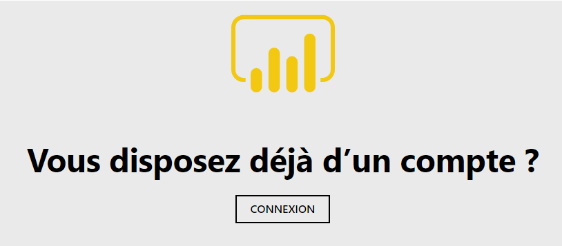  
3. On vous demandera ensuite soit d’entrer ou de choisir un compte :   
    - La 1ère fois que vous connectez, la fenêtre Se connecter de Microsoft s’affichera comme montré ci-dessous.   
     
    - Entrez votre compte de l’infonuagique (prenom.nomfamille@cloud.statcan.ca), et cliquez sur **Suivant**.  
    - Lors des connexions subséquentes, la fenêtre Choisir un compte de Microsoft s’affichera, comme montré ci-dessous.   
Cliquez sur votre compte cloud.statcan.ca.  
  
4. On vous demandera ensuite d’entrer le mot de passe de votre compte l’infonuagique.  Une fois entré, cliquez sur **Connexion**.  
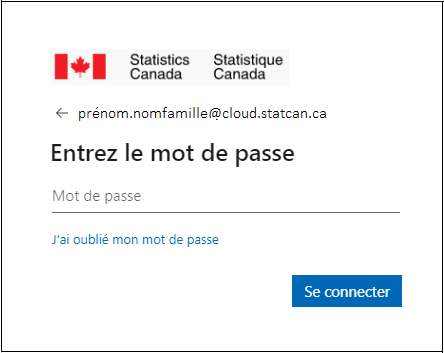   
5. Enfin, vous recevrez peut-être une demande de Statistique Canada disant Plus d’informations requises – Votre organisation a besoin de plus d’information pour préserver la sécurité de votre compte, comme montré ci-dessous, surtout si c’est la première fois que vous ouvrez une session sur le portail Web avec votre compte de l’infonuagique. Cliquez sur **Suivant** et assurez-vous de suivre les instructions pour sécuriser votre compte par l’authentification de votre courriel et la configuration de vos questions de sécurité. 

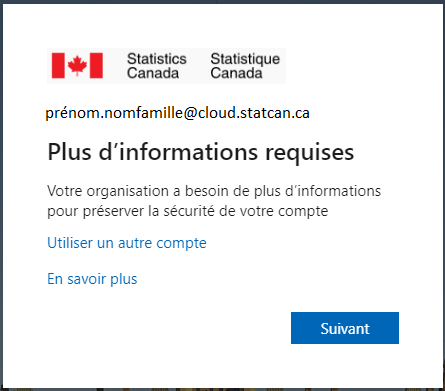  
 
## Informations d’identification pour rechercheurs au autres départements
*S'applique à **la majorité** des services infonuagiques Azure (Power BI, Databricks, Data Factory, machines virtuelles, etc.)*

1. En utilisant Chrome, Chromium ou Edge, ouvrir soit :   
    - Le tableau de bord Azure de l'[Environnement d'analyse collaboratif](https://portal.azure.com/#@cloud.statcan.ca/dashboard/arm/subscriptions/d2d3c198-2275-4c7b-bd79-0fc949819c0e/resourcegroups/dashboards/providers/microsoft.portal/dashboards/82e4ac29-4a7f-4ba0-9244-67835193508a)
    - Le lien URL à l’app. Power BI (si fourni), ou la [page de connexion au service Power BI](https://powerbi.microsoft.com/fr-fr/landing/signin/)  
    - [Azure Databricks](https://canadacentral.azuredatabricks.net/)  
    - [Azure Data Factory](https://adf.azure.com/)      
2. En ouvrant un lien URL à une app. Power BI ou la page de connexion au service Power BI, vous serez dirigé vers la page d’ouverture de session de Microsoft Power BI, comme montré ci-dessous, disant “Vous disposez déjà d’un compte?“. Cliquez sur **CONNEXION**.  
  
3. On vous demandera ensuite soit d’entrer ou de choisir un compte :  
    - La 1ère fois que vous connectez, la fenêtre Se connecter de Microsoft s’affichera comme montré ci-dessous.  
   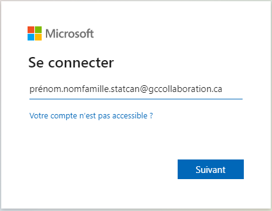  
    - Connectez-vous avec vos informations d’identification de messagerie officielle/O365 ou vos informations d’identification GCCollaboration (p. ex., prenom.nom.departement@dept-dépt.gc.ca, prenom.nom.departement@gccollaboration.ca or non@gov.prov.ca), et cliquez sur **Suivant**.  
    - Lors des connexions subséquentes, la fenêtre Choisir un compte de Microsoft s’affichera, comme montré ci-dessous.  
Cliquez sur vos informations d’identification de messagerie officielle/O365 ou vos informations d’identification GCCollaboration (p. ex., prenom.nom.departement@dept-dépt.gc.ca, prenom.nom.departement@gccollaboration.ca or non@gov.prov.ca).  
  
4. On vous demandera ensuite d’entrer le mot de passe de votre compte l’infonuagique.  Une fois entré, cliquez sur **Connexion**.  
 
    - Si votre adresse électronique officielle ne prend pas en charge ce type de connexion, vous recevrez automatiquement par courrier électronique un code à saisir en lieu et place d'un mot de passe, puis vous cliquerez sur **Connexion**.
    
   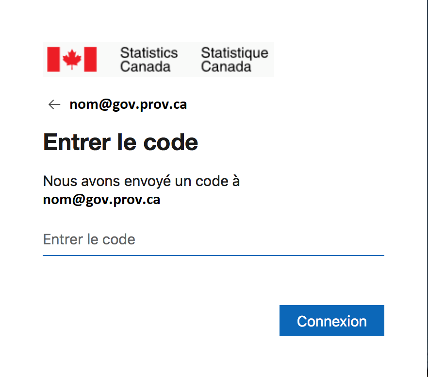  
    - Le courriel que vous recevez ressemblera à ce qui suit. Si vous ne le recevez pas, vérifiez qu'il n'a pas été envoyé dans votre dossier Spam ou Junk. 
    
   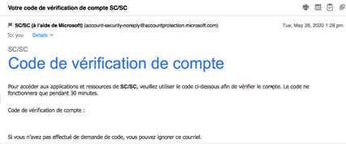  
5. **Accepter** les autorisations de révision (consentement pour la première fois uniquement).  
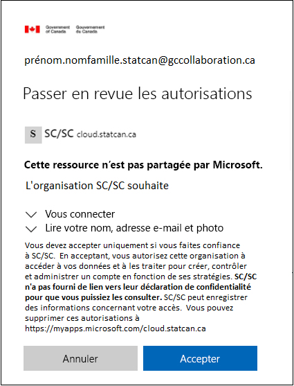 
6. Vous recevrez alors le message suivant. **Attendez** jusqu’à la fin.  
 
7. Enfin, vous recevrez peut-être une demande de Statistique Canada disant Plus d’informations requises – Votre organisation a besoin de plus d’information pour préserver la sécurité de votre compte, comme montré ci-dessous, surtout si c’est la première fois que vous ouvrez une session sur le portail Web avec votre compte de l’infonuagique. Cliquez sur **Suivant** et assurez-vous de suivre les instructions pour sécuriser votre compte par l’authentification de votre courriel et la configuration de vos questions de sécurité. 

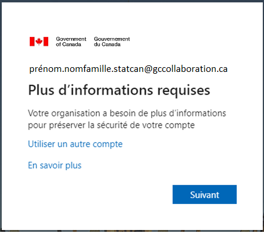  
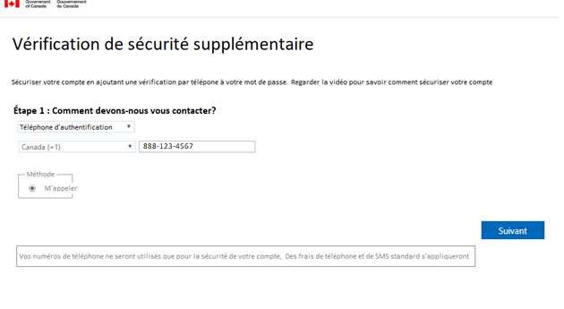  

## Compte du réseau de StatCan (prenom.nomfamille@statcan.gc.ca)   
*S'applique seulement au service Power BI pour les employés de Statistique Canada. Pourrait être une option future pour les autres services de l'Environnement d'analyse collaboratif (EAC).*

Veuillez noter que l’étape 5 (mot de passe d’Internet) ci-dessous peut arriver à n’importe quel moment.

1. À partir du réseau B ou du OZ, et en utilisant Chrome, Chromium ou Edge, ouvrir soit :    
-Le lien URL à l’app. Power BI (si fourni), ou  
-https://powerbi.microsoft.com/fr-fr/landing/signin/  
2. Vous serez dirigé vers la page d’ouverture de session de Microsoft Power BI, comme montré ci-dessous, disant “Vous disposez déjà d’un compte?“. Cliquez sur **CONNEXION**.   
     
3. On vous demandera ensuite soit d’entrer soit de choisir un compte :  
    - La 1ère fois que vous connecter, la fenêtre Se connecter de Microsoft s’affichera comme montré ci-dessous.   
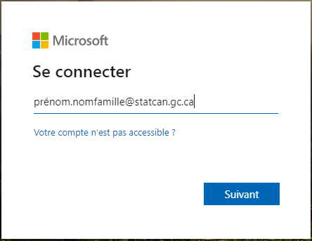  
    - Entrez votre compte du réseau de StatCan (prenom.nomfamille@statcan.gc.ca), et cliquez sur **Suivant**.  
    - Lors des connexions subséquentes, la fenêtre **Choisir un compte** de Microsoft s’affichera, comme montré ci-dessous. Cliquez sur votre compte statcan.gc.ca.  
  
4. Vous allez ensuite recevoir le message de Microsoft “Vous allez être redirigé vers la page de connexion de votre organisation“. 
5. Vous serez peut-être amené à entrer votre nom d’utilisateur et votre mot de passe d’**Internet** comme montré ci-dessous. Une fois entrés, cliquez sur **Ouvrir une session**.   
  
6. 6.	On vous demandera ensuite de vous connecter à votre compte du réseau de StatCan (c.-à-d. prenom.nomfamille@statcan.gc.ca) et d’entrer votre mot de passe du réseau A. Une fois entrés, cliquez sur **Ouvrir une session**.    
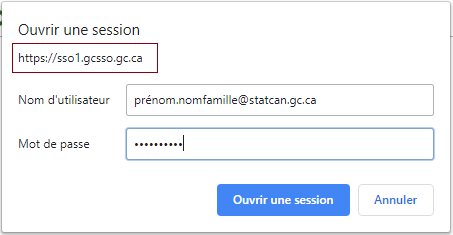  
7. 7.	Enfin, vous recevrez peut-être une demande de Statistique Canada disant Plus d’informations requises – Votre organisation a besoin de plus d’information pour préserver la sécurité de votre compte, comme montré ci-dessous, surtout si c’est la première fois que vous ouvrez une session sur le portail Web avec votre compte du réseau de StatCan. 
Cliquez sur Suivant et assurez-vous de suivre les instructions pour sécuriser votre compte par l’authentification de votre courriel et la configuration de vos questions de sécurité. 
  
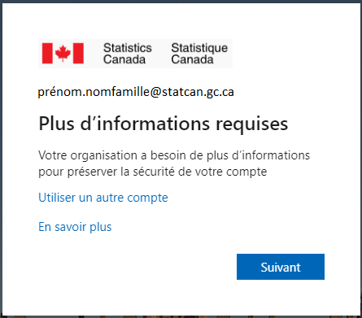   

## Documentation Microsoft
* https://docs.microsoft.com/fr-ca/azure/azure-portal/
 

 

 

 

 

