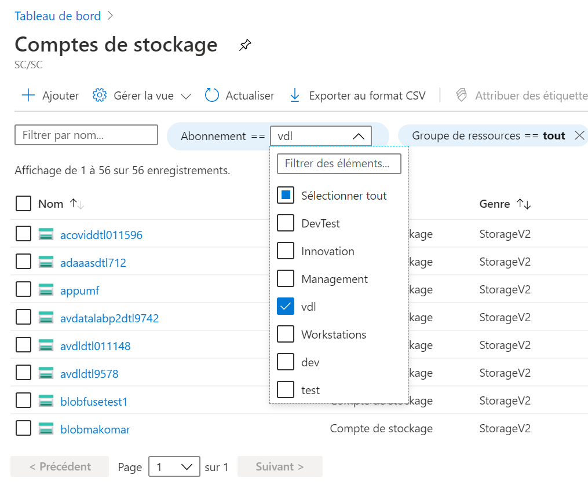

# Explorateur de stockage Azure

Les données peuvent être téléversées sur la plateforme par l'entremise du portail Azure ou de l'application Explorateur de stockage Azure. Une
fois qu'elles auront été téléversées dans un compte de stockage externe Blob Azure, elles seront automatiquement ingérées dans un compte de
stockage interne Azure Data Lake Storage (ADLS). Lorsque les données seront dans Data Lake, les utilisateurs pourront choisir des outils de
transformation et d'intégration. Ils pourront utiliser des outils Web, comme Databricks et Data Factory, pour effectuer des transformations ou
des outils de bureau sur une machine virtuelle pour transformer et analyser les données. Les données nettoyées et transformées pourront
être placées dans différents dossiers (contenant des ensembles de données traitées ou de meilleure qualité) ou téléversées dans une base
de données. Les utilisateurs seront de nouveau en mesure de se connecter à ces données à l'aide des outils qu'ils souhaiteront utiliser, et ce, à
partir de leur machine virtuelle ou d'autres services offerts sur la plateforme, tels que Databricks et Data Factory.

**Rappel :** Les comptes de stockage internes ne sont accessibles qu'à partir d'une machine virtuelle dans l'Environnement d'analyse
collaboratif (EAC); voir la [FAQ](FAQ.md).

## Explorateur de stockage -- Portail Azure

1.  Accédez au compte de stockage (aperçu) Storage Account (Preview)     à partir du portail Azure.
    

2.  Sélectionnez votre type d'abonnement, puis naviguez dans votre     compte de stockage.
 

## Explorateur de stockage -- Poste de travail personnel ou machine virtuelle sur nuage

1.  Téléchargez l'application [Explorateur de stockage Azure](https://azure.microsoft.com/fr-ca/features/storage-explorer/)et installez-la sur votre poste de travail ou votre machine virtuelle.

2.  Lancez l'Explorateur de stockage Azure à partir du menu Démarrer.

3.  Ouvrez une session avec votre compte Azure.
 

4.  Entrez vos justificatifs d'identité du nuage.

## Explorateur de stockage -- VDI du réseau B

*Cette section s'adresse aux employés de Statistique Canada qui doivent
téléverser des données du réseau B.*

1.  Téléchargez l'application [Explorateur de stockage Azure](https://azure.microsoft.com/fr-fr/features/storage-explorer/) et installez-la sur votre VDI du réseau B.

2.  Lancez l'Explorateur de stockage Azure à partir du menu Démarrer.

3.  Sur un VDI du réseau B, la seule façon d'accéder à votre compte de stockage est d'utiliser un jeton SAP temporaire. Pour en faire la demande, veuillez communiquer avec l'équipe de soutien par l'intermédiaire du canal https://cae-eac.slack.com.

**Note :** Pour obtenir des renseignements sur la configuration des paramètres du proxy du réseau B, consultez la
[FAQ](FAQ.md).

## Documentation Microsoft

- [Téléchargez l'Explorateur de stockage Azure](https://azure.microsoft.com/fr-fr/features/storage-explorer/)
- [Démarrage rapide : Charger, télécharger et lister les objets blob avec le portail Azure](https://docs.microsoft.com/fr-fr/azure/storage/blobs/storage-quickstart-blobs-portal)
